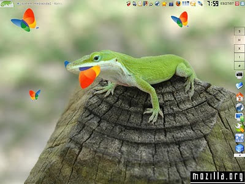

=  openSuSE 10.2

"it's almost perfect! very nice OS"

Wah, akhirnya setelah dikecewakan oleh debian, saya mendownload distro yang
telah saya pakai selama 3 ... 4 ... hampir 5 tahun, yang sekarang telah
di-adopsi oleh Novell: openSuSE 10.2.

openSuSE-10.2, standar, dari versi 9, jumlahnya 5 cd ditambah satu CD add-on.
Membutuhkan waktu dari pagi sampe sore untuk menunggu download sampai selesai
semuanya.

Setelah membakar CD 1 menggunakan cd-rw teman, siap-siap untul melakukan
instalasi: bikin kopi + satu batang rokok.
Masukan CD 1, booting lewat CD-ROM, dan tunggu.

Pilih menu instalasi, dan 20 detik kemudian "Please insert CD 1"! ny*ng!

Saya sudah curiga cd-nya memang tidak bagus ... pasti bukan SuSE-nya, pasti.

OK ... ulang lagi dari awal, sekarang instalasi dengan menggunakan mode "safe
mode".
Mode yang saya "biasa" lakukan kalau menginstal SuSE 9.0.
Pilih menu instal lewat harddisk.

Sekarang masuk ke proses konfigurasi instalasi.
Sedikit bingung pada saat mau memilih "KDE apa GNOME ya?", dan 5 jam kemudian
akhirnya saya memutuskan GNOME.

10 jam kemudian, "Cannot read dejavu package"
Yaaahhh!
Ternyata pas dilihat yang terkopi ke direktori src cuma cd 1 saja, argh!

Ulang lagi dari awal, sekarang pilih KDE dan tanpa "dejavu" package.
Dan 1 tahun kemudian ... SUKSES.

*  Menu "Start"-nya sangat nge-kick!
*  Ada software "Beagle", seperti Google Desktop Search-nya di windows
*  YaST-nya sudah pasti sangat membantu
*  Seandainya, kalau bukan karena beberapa error kecil yang dapat diselesaikan "dengan tangan", openSuSE hampir mendapatkan nilai perfect
*  Antara 1-11, openSuSE 10.2 saya kasih nilai 10.2 deh ;)

