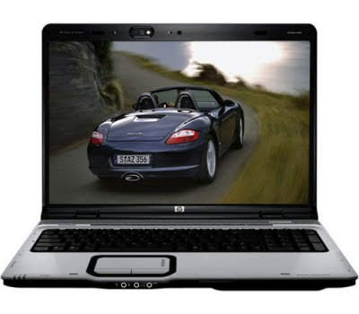
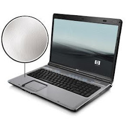

=  Haha, akhirnya dapat juga

**PROCESSOR**
AMD Turion 64 X2 Dual-Core Mobile Technology TL-56 1.8GHz
512KB+512KB L2 Cache

**MEMORY**
2048 MB DDR2 System Memory (2 Dimm)
Max Memory: 2GB

**HARD DRIVE**
160 GB (5400 RPM) SATA

**MULTIMEDIA DRIVE**
LightScribe Super Multi 8X DVD R/RW with Double Layer Support

**DIGITAL MEDIA**
5-in-1 integrated Digital Media Reader for Secure Digital cards, MultiMedia cards, Memory Stick, Memory Stick Pro, or xD Picture cards.

**HP FINISH and FEATURES**
HP Imprint Finish and HP Pavilion WebCam with Integrated Microphone.

**DISPLAY**
17.0" WXGA+ High-Definition BrightView Widescreen (1440 x 900).

**VIDEO GRAPHICS**
NVIDIA GeForce Go 6150 (UMA) w/ Up to 559 MB shared RAM.

**COMMUNICATION**
High speed 56k modem.

**NETWORK CARD**
Integrated 10/100BASE-T Ethernet LAN (RJ-45 connector)

**WIRELESS**
802.11b/g WLAN

**KEYBOARD**
101-key compatible,
Notebook keyboard with scroll bar and integrated numeric keypad,
2 Quick Launch Buttons-HP Quick Play Menu and DVD.

**POINTING DEVICE**
Touch Pad with On/Off button and dedicated vertical scroll Up/Down pad.

**SOUND**
Altec Lansing

**PC CARD SLOTS**
1 ExpressCard/54 Slot (also supports ExpressCard/34).

**EXTERNAL PORTS**
4 Universal Serial Bus (USB) 2.0,
1 Headphone out w/SPDIF Digital Audio,
1 microphone-in,
1 VGA (15-pin),
1 TV-Out (S-video),
1 RJ-11 (modem),
1 RJ -45 (LAN),
1 Expansion Port 3, 1 IEEE 1394 Firewire (4-pin),
1 Consumer IR (Remote Receiver).

**DIMENSIONS**
15.16 (L) x 11.65" (W) x 1.57" (H).

**WEIGHT**
7.8 lbs

**POWER**
90W AC Adapter,
8-Cell Lithium-Ion battery

**OPERATING SYSTEM**
Genuine Windows Vista Home Premium.

**SECURITY AND SUPPORT**
Kensington MicroSaver lock slot,
Power-on password,
Accepts 3rd party security lock devices,
HP Total Care Help & Support Center,
PC Recovery (Softthinks Restore Solution).

**MULTIMEDIA**
Vongo,
HP PhotoSmart Essentials,
HP Quick Play,
Muvee AutoProducer Basic Edition,
RealRhapsody,
Roxio Creator 9 Basic,
Snapfish.
