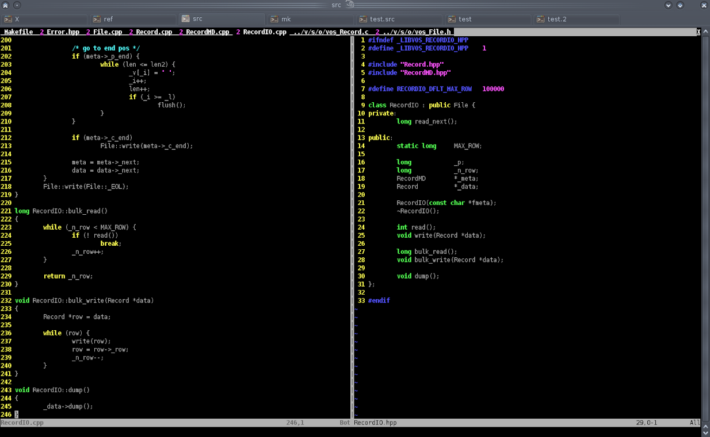
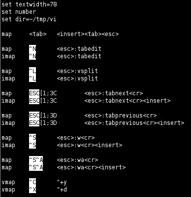

=  The Stupid IDE

The stupid IDE = Konsole + vim.

Keyboard shortcuts for Konsole:

*  `shift + left-arrow`: view previous tab.
*  `shift + right-arrow`: view next tab.
*  `CTRL + shift + n`: new tab.

Keyboard shortcuts for Vim:

*  `ALT + right-arrow`: go to next tab.
*  `ALT + left-arrow`: go to previous tab.
*  `CTRL + n`: new tab.
*  `CTRL + l`: split window left and right.
*  `CTRL + \`: switch between the window.
*  `CTRL + s`: save current buffer.
*  `CTRL + page-up`: move tab to the left.
*  `CTRL + page-down`: move tab to the right.

Complete vimrc file: http://gist.github.com/430841

