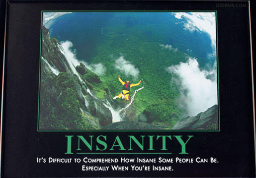
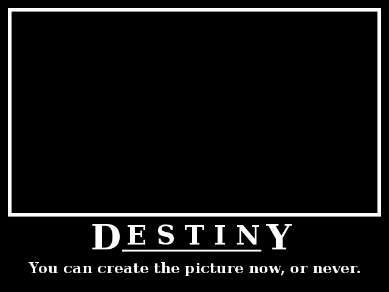
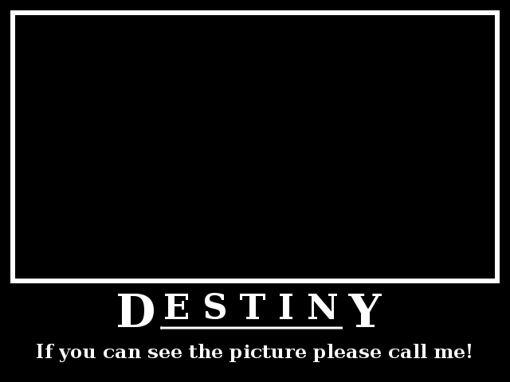
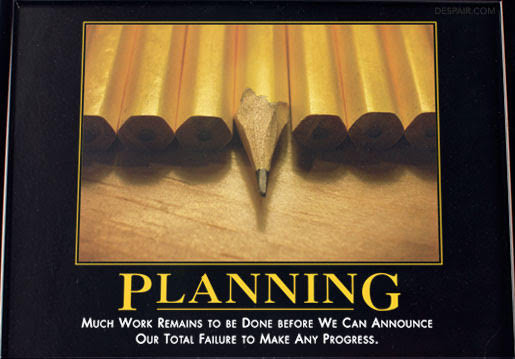

=  Destiny

[quote, Charles Dickens, The Old Curiosity Shop]
"No man knocks himself down; if his destiny knocks him down, his destiny must
pick him up again."

I can not remember the first
http://en.wikipedia.org/wiki/Motivational_poster[motivational poster] (or
inspirational poster) [1]
that I saw, but my love to those posters is growing up every time i see one
(especially a
http://www.despair.com/viewall.html[demotivational one] [2] :).
If you does not know what a (de)motivational poster was, i will give you an
example, here,

So, I am intrigue to create one,

And this one,

Now, let's talk about destiny; From
http://encyclopedia.thefreedictionary.com/destiny[Wikipedia Encyclopedia] [3] ,

"Destiny refers to a predetermined course of events.
It may be conceived as a predetermined future, whether in general or of an
individual.
It is a concept based on the belief that there is a fixed natural order to the
universe."

If that definition was too formal for you, non-English speaker like me, i will
try to use a
http://en.wikipedia.org/wiki/Car_analogy[car analogy]
here to make it simple,

____
Joe and Alice want to go from city A to city E.
Alice goes to airport, unfortunately there is no airport in city E, the
nearest airport is only at city C.
Alice bough a ticket to city C.
At the airport in city C Alice meet his old friend, they where talk a lots
until the next morning, and later Alice's mom called from home, say that her
kitten just die, "go to home now!".
Alice go home and never going back to city C.

Joe know that no airport in city E, so he use a car.
From city A to city E, Joe need to go to city B first.
Joe driving a car night and day, unfortunately at some point in some unknown
street he hit a cat.
Joe stop and try to save the cat, but the cat has already dead.
Joe take the cat body and knock every door in around neighbor looking for cat
owners.

Joe meet Alice at Alice's house, and their live happily ever after.
____

What happen if Joe never hit a cat ? Joe and Alice meet each other at city E,
and their live happily ever after.

When Joe meet Alice at city E or at Alice's home, we can say that it's Joe
destiny to meet Alice, or vice-versa, but when Alice arrived at city C or when
Joe hit the cat we cannot say that it's Joe destiny to meet Alice because it's
never happen, yet.

Do not take this story literally (I don't even use Car Analogy, i just put a
car word in some sentence, sorry), person meet person, or person use a car,
but see it as a person who trying to achieve a goal.
To meet with the goal you can use different methods, different method can lead
to a different result, another method another result.
Even if you cannot meet or never meet the goal does not mean that you where
fail, it's just that it is not your destiny.
My point here is, YOU CANNOT MOVE A PENCIL USING YOUR MIND!.

_I hate planning, since I had a goal._

Live is short, so this is my goals,

*  Create a successful startup company.
*  Watch a Coldplay, Broken Social Scene (BSS), Slipknot, and U2 concert a
   live.
*  Die.

Here is my plans,

*  Save some money
*  While i save a money, try to find and create a simple product for startup.

Detailed plan,

*  Find a Slipknot concert in one of America city.
*  Go to America, watch the concert.
*  While in America find the latest BSS concert, i hope it was in Canada.
*  Go to Canada, watch the concert.
*  While in Canada, find the latest U2 concert in Europe.
*  Go to Europe, watch the concert.
*  While in Europe, find the latest Coldplay concert in England.
*  Go to England, watch the concert.
*  Go to home.

**"Yes, i can."**

--

[1] http://en.wikipedia.org/wiki/Motivational_poster

[2] http://www.despair.com/viewall.html

[3] http://encyclopedia.thefreedictionary.com/destiny
