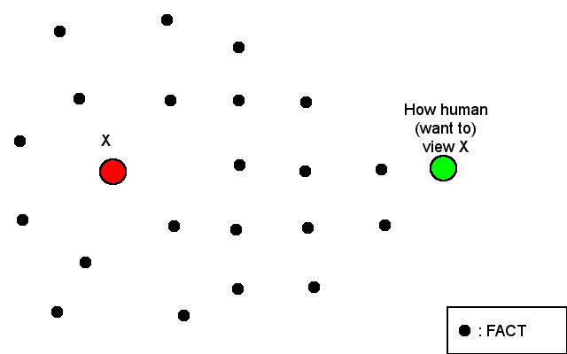

=  Life game: connect the dots

____
Red dot (X) is some thing that someone trust or want to believe to be true.
Green dot (Y) is the start point where someone will go to X using black dots.
Black dots is fact/rule/thing that will make X become true or believed.
Your task is to connect the Green dot to Red dot using black dot as a base
point.
____

This article is not mean to be vague, is just that, first, it take some point
in your life until you realize it is not vague at all and you will say "Oh";
second, it was not written for public actually, it just some random thought
that always flying in my head every nights that need to be laid down so I can
think about anything else and commit my memory in this journal.

The picture is represent what I have been thinking over a few nights, about
how I, the green-dot (Y), perceive a red-dot (X) in my life.
Instead of connecting the black dots by myself, my environment and culture
where I live and growing up already set that for me.
So, the line is already connected to the X, I just need to believe that all
the black dots is exist and the line is true.
The problem is, not many people, even me, questioning those black-dots.

This pattern also can be applied to anything in life, except that black dot
represent something that we know (thing, place) or rule that has been set
before which become what we want to believe (X).

For example, some peoples on conspiracy theory, people that believe X was not
true, will always seek anything (black-dots) to prove that their were right.
They will search, make or do anything that can make a line from green-dot to
prove that X was not true or their opinion was right.
Another people that does not believe conspiracy theory can also search for any
black-dot (evidence) to disprove the theory or just accept the fact as what it
is.

The picture also what make me respect another person in life because between
me and others maybe we don't have the same connected dots.
But, the problem is another person don't know about this.
They don't know that there is another black dots beside their own connected
dots.
The result of this will be varies.

In case of knowledge: people that have more knowledge (black-dot) about X will
make it more knowledgeable from point of view of people that lack some of
knowledge.
Another side of this point of view is what we call people ignorant.
Here is a semi related video [1], by Robery Seyfarth about Theory of Mind,

+++
<iframe
	src="https://www.youtube.com/embed/XDtjLSa50uk?wmode=transparent&amp;rel=0&amp;autohide=1&amp;showinfo=0&amp;enablejsapi=1"
	tabindex="-1"
	frameborder="0"
></iframe>
+++

Some back-links for furthers reading,

*  http://www.youtube.com/watch?v=XDtjLSa50uk[Theory of Mind - Robery
   Seyfarth]

*  http://www.randi.org/site/index.php/swift-blog/1057-what-everyone-knows.html[What
   Everyone knows]

*  http://youarenotsosmart.com/2010/09/11/the-texas-sharpshooter-fallacy/[The
   Texas Shartshooter Fallacy]
