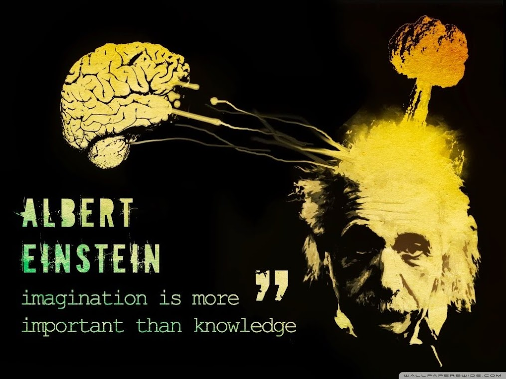

=  Imagination Is More Important Than Knowledge

There is an anecdotal or inspirational quote from famous and genius people
Albert Einstein that circulating around the internet, which rendered in an
image like this,

Knowledge, how many of them that you have, even if you can remember all of the
articles in Wikipedia, it does not useful if you do not put it into to
something, contributing to society, making something that useful, or helping
the others--using your knowledge.

The same goes to imagination.
Imagination without knowledge can goes to daydream or schizophrenia.
You want to make cookie but does not know the recipes or how to bake it.
You want to be a dancer but you do not have legs.

So, which one is more important?
Knowledge first, and then imagination, and then creating something.
