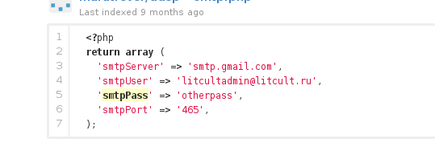

=  Holy Github!

I use git to keep tracks of my home configuration and github as my backup
server.
Accidentally, today, when I run diff on my home directory with my git
configuration backup I found that my .gitconfig option "[sendemail]" has been
changed, and ...

Oh, wait ...

What if someone also do this on github?

So, I go to github and search for "smtppass". I found some repository with
`smtppass` filled in.

Here is a result that I tried and working,

Holy github!

**Update:** I have inform github support about this, and here is the reply
from one of their staff.

----
From: "Haleigh (GitHub Staff)" <support@github.com>
To: Mhd Sulhan <m.shulhan@gmail.com>
Message-ID: <discussions/d0a63ac0c71311e380db04477d516110/comments/1012466@github.com>
In-Reply-To: <53514e2c1a5c3_29363fe8e771f2a4785aa@github-fe133-cp1-prd.iad.github.net.mail>
References: <53514e2c1a5c3_29363fe8e771f2a4785aa@github-fe133-cp1-prd.iad.github.net.mail>
Subject: Re: Email password leak in public repository.
Mime-Version: 1.0
Content-Type: text/plain;
charset=UTF-8
Content-Transfer-Encoding: 7bit
X-SG-EID: GILdSeq0y2tr3ZX5/p0O19oxV0pQOx/0hP7Msw8IaX0VG7CuD6h7wAYZ+F9TXKd1to1U7+2zWkwIXdmB57c4/j/pSgA1W5Qs6/bclca5tNQatpKAkC7FNdI48OcuBxWJl/hOyMo9Ux1ljLBQsLw3NJUc5I8Mrf+acqJL3xWJ0Ow=
X-Feedback-ID: 1120282:2Wv/oNEpTh6CoJNE/kv0Vebovh40FCRTex+O2CJZzhU=:2Wv/oNEpTh6CoJNE/kv0Vebovh40FCRTex+O2CJZzhU=:SG

Hi there,

Thanks for the report. We're checking it out.

Cheers,
Haleigh
----
