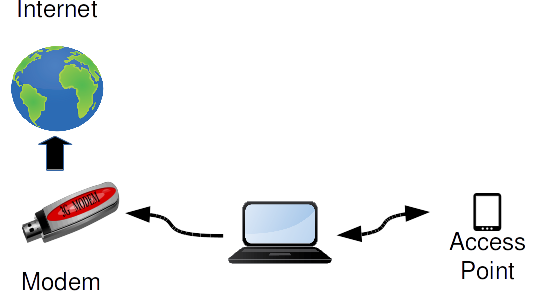

=  Android reverse tether di GNU/Linux

**Skenario:** Anda memiliki koneksi internet di laptop/PC, baik itu
menggunakan LAN atau modem USB, dan ingin menggunakan koneksi tersebut di
smartphone/tablet Android anda.
Berikut diagramnya,

Solusinya adalah dengan menggunakan metoda reverse tethering, yaitu kebalikan
dari tether.

Pada mode tether, laptop terhubung ke tablet menggunakan WI-FI AP di tablet
dan menggunakan koneksi internet di smartphone/tablet untuk terhubung ke
internet, kebalikannya yaitu mode reverse tether dimana laptop terhubung ke
tablet menggunakan WI-FI AP di tablet tapi tablet menggunakan koneksi internet
di laptop untuk terhubung ke internet.

Untuk contoh implementasi disini perangkatnya adalah laptop dengan OS Linux
yang terkoneksi ke internet lewat USB modem, dan terkoneksi ke tablet Android
menggunakan nirkabel (WI-FI).

Kebutuhan untuk tablet Android adalah,

*  sudah di rooting,
*  memiliki fitur WI-FI Access Pop,
*  sudah terpasang aplikasi terminal seperti Android Terminal Emulator.

Caranya adalah sebagai berikut.

*  Sambungkan laptop ke internet dengan USB modem.
*  Atur supaya laptop dapat meneruskan setiap data dari perangkat jaringan ke
   ppp0 (USB modem) menggunakan perintah iptables di bawah ini,
+
----
iptables -t nat -A POSTROUTING -o ppp0 -j MASQUERADE
iptables -P FORWARD ACCEPT
----

*  Hidupkan WI-FI AP di perangkat tablet Android.
*  Sambungkan WI-FI di laptop supaya terhubung ke WI-FI di tablet Android.
   Catat alamat laptop yang terhubung ke WI-FI tablet, misalnya
   192.168.43.181.
   Alamat ini nanti akan menjadi gateway nantinya bagi tablet Android.
*  Buka terminal di tablet Android, jalankan perintah di bawah sebagai super user (root),
*  Reset IP dari perangkat 3G supaya data tidak terkirim lewat 3G,
+
----
# ifconfig rmnet0 0.0.0.0
----

*  Alihkan koneksi DNS ke publik DNS (8.8.8.8),
+
----
# iptables -t nat -A output -p udp --dport 53 -j DNAT --to-destination 8.8.8.8:53
----

*  Hapus default gateway,
+
----
# ip r del default
----

*  Atur default gateway ke IP di laptop,
+
----
# ip r add default via 192.168.43.181
----

*  Atur DNS ke publik DNS,
+
----
# setprop net.rmnet0.dns1 8.8.8.8
# setprop net.rmnet0.dns2 8.8.4.4
# setprop net.dns1 8.8.8.8
# setprop net.dns2 8.8.4.4
----

Selesai.
Sekarang anda sudah bisa browsing di smartphone/tablet Android anda
menggunakan koneksi internet di laptop.
