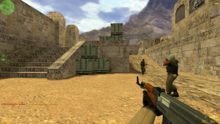
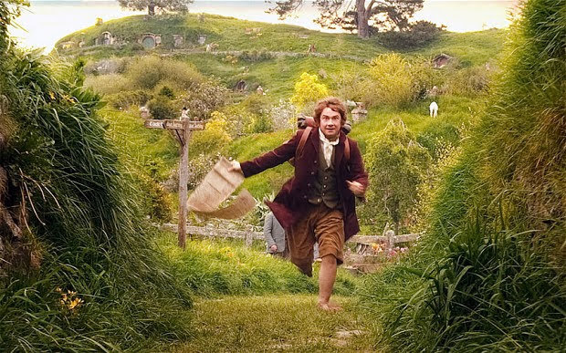

=  Kulminasi dari Ilmu Seni

Kulminasi dari bidang ilmu komputer adalah permainan komputer (_game_).
Dalam sebuah game yang tercanggih diterapkan semua sub-bidang dari ilmu
komputer dan terkadang mengikutkan ilmu lainnya.
Sebuah _game_ menerapkan,

*  basisdata - penyimpanan dan pemuatan teksture, hasil permainan;
*  algoritma dan pemrograman - termasuk konkurensi, game yang paling canggih
   memanfaatkan paralelisme dengan tingkat tertentu;
*  komputer grafis - dengan memanfaatkan grafik dan memory video seefisien
   mungkin.
   Bahkan game menyebabkan berkembangnya pemrosesan di VGA, terkadang proses
   pada rendering dan alur permainan mengikutkan formula fisika, seperti
   penggunaan efek Coriolis saat peluru ditembakan;
*  intelijensi buatan - pemain melawan monster yang dapat bereaksi terhadap
   perilaku;
*  jaringan komputer - game multiplayer menggunakan komunikasi antar komputer,
   tidak saja penggunaan jaringan, di dalamnya juga ada penerapan pemrograman
   jaringan yang tidak sesederhana seperti program chat.

Bisa terbayang bahwa dalam sebuah _game_ semua itu diterapkan menjadi sebuah
permainan yang terkadang dilihat hanya sebagai sekumpulan _pixel_ yang
berganti warna.

Lalu apa kulminasi dari bidang Ilmu Seni?

Saat menonton trilogi dari The Hobbit yang terakhir
https://en.wikipedia.org/wiki/The_Hobbit:_The_Battle_of_the_Five_Armies[The
Battles of The Five Armies], pikiran saya langsung berkata, "ini adalah
kulminasi dari semua seni".
Dalam sebuah film, sebagai contohnya saya menggunakan referensi The Hobbit,
kita dapat melihat bagaimana bidang ilmu seni digunakan,

*  literatur pada naskah, tulisan - dari alur cerita sampai perkataan dari
   setiap pemain dibuat sedemikian rupa untuk menarik alur cerita dan karakter
   dari pemain.
   Pemilihan kata untuk pemain pun dipilih, tidak sembarangan.
*  Akting, drama - di Hobbit kita bisa lihat bagaimana karakter setiap pemain
   memainkan karakter yang berbeda-beda, ada yang pelit, ada yang suka makan,
   ada juga yang bijak.
   Dengan akting, pemain dapat menarik emosi penonton menjadi membenci mereka,
   menyukai mereka, membuat penonton ikut sedih atau marah.
   Pernah mendengar teman anda mengatakan bahwa "saya tidak suka film X,
   karena saya tidak suka dengan si Y (salah satu karakter)" itu berarti
   akting si Y sangat bagus sehingga dapat meyakinkan penonton untuk tidak
   menyukainya.
*  Arsitektur - lihatlah rumah dari hobit, saya sangat suka dengan pintunya
   yang bulat.
*  Pakaian, kostum, makeup - seorang penyihir tidak mungkin menggunakan kaus
   oblong dan celana jeans, dan mengatakan dirinya penyihir, bukan?
   Tidak hanya pakaian, dari potongan rambut, jenggot untuk dwarf, warna
   rambut perak pada elf, semua itu dipilih dengan karakternya masing-masing.
*  Musik - seni performansi lain yang terkadang diterapkan dalam beberapa film
   yaitu tarian.
*  Komputer grafis - film terkadang memadukan penerapan komputer grafis untuk
   menggambarkan latar yang tidak bisa dibuat dengan tangan.
*  Fotografi - saya tidak istilah yang tepat digunakan pada film, tapi sisi
   dari pengambilan gambar mempengaruhi bagaimana penonton melihat film.

Dan dengan nilai sekitar Rp. 50000 kita menikmati semua hasil kulminasi itu
hanya dalam waktu lebih kurang 180 menit.
