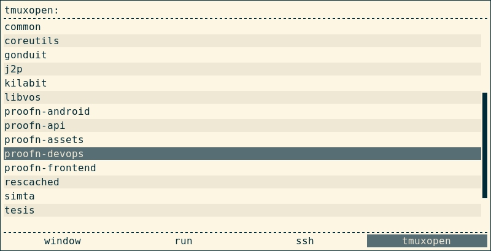

=  List and open tmux session with rofi

This article assume that you already know about rofi [1] and tmux [2].

In rofi you can list ssh client using command `rofi -show ssh`, and when
selecting one of it will create new terminal and start opening ssh connection
to selected server.
But what if we want to start or create new tmux session using predefined list
of session name like this one:

Lets start by creating a zsh script as module that can be executed by rofi.

First, create new file `~/bin/rofi-tmuxopen.sh`.

Create or modify rofi config, `~/.config/rofi/config`, by adding our custom
`tmuxopen`

----
! "Enabled modi" Set from: Default
rofi.modi: window,run,ssh,tmuxopen:~/bin/rofi-tmuxopen.sh
----

Next we start creating script.
Open the script file and create an associative array to map session name with
their working directory,

----
#!/usr/bin/env zsh

typeset -A session_map

session_map=(
  tesis    $HOME/tesis
  projectA $HOME/workspaces/projectA
)
----

We collect the key from our `session_map` to be displayed on rofi.

----
...
typeset -a session_name

for k v in "${(@kv)session_map}"; do
	session_names=($k $session_names)
done
----

The first time rofi execute our script, it will pass it with no parameter
`( $# -eq 0 )`, so what we will do is send the list of session name as an
input to be displayed by rofi.

----
...
if [[ $# -eq 0 ]]; then
	echo "$session_names" | tr ' ' '\n' | sort -n
	exit 0
fi
----

Each item must be separated by newline (`\n`), thats why we replace single
space with newline, and that is why your session name should not have space in
them.

When you select one of the item in list, rofi will execute the script again
with parameter, just like we call the script from terminal.
So, what we will do was,

*  catch the first parameter,
*  check if its exist in our session mapping,
*  and get their working directory.

----
...
SELECTED=$1
TMUXDIR=
FOUND=0

## - Check if user selection match with session mapping.
## - Get session working directory
for k v in "${(@kv)session_map}"; do
	if [[ "$k" == "$SELECTED" ]]; then
		TMUXDIR=$v
		FOUND=1
		break
	fi
done

if (( $FOUND == 0 )); then
	echo "Unknown session name $1"
	exit 1
fi
----

Last code was spawning new terminal to open new tmux session with working
directory set to `TMUXDIR`

----
$TERMINAL -e tmux new -c $TMUXDIR -As $SELECTED >/dev/null &
----

Thats it.

==  References

[1] https://davedavenport.github.io/rofi/

[2] https://tmux.github.io/
