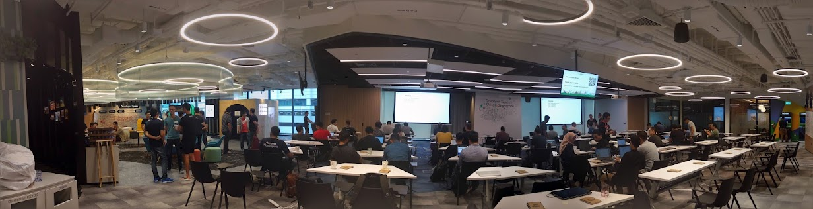
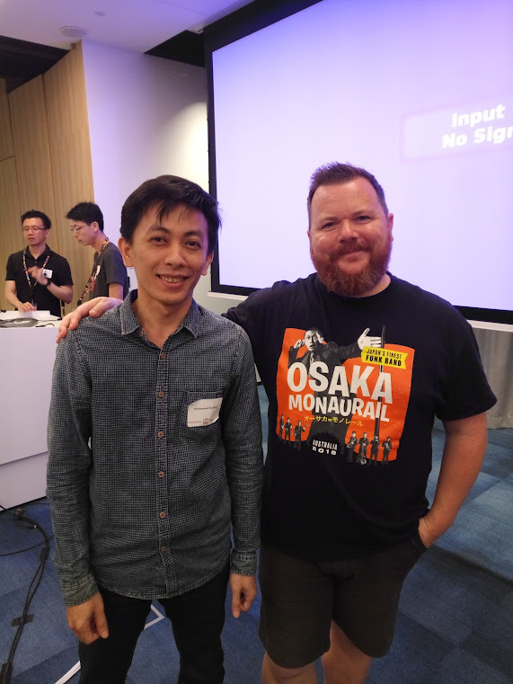
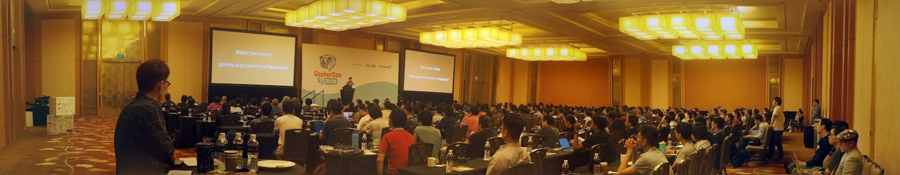
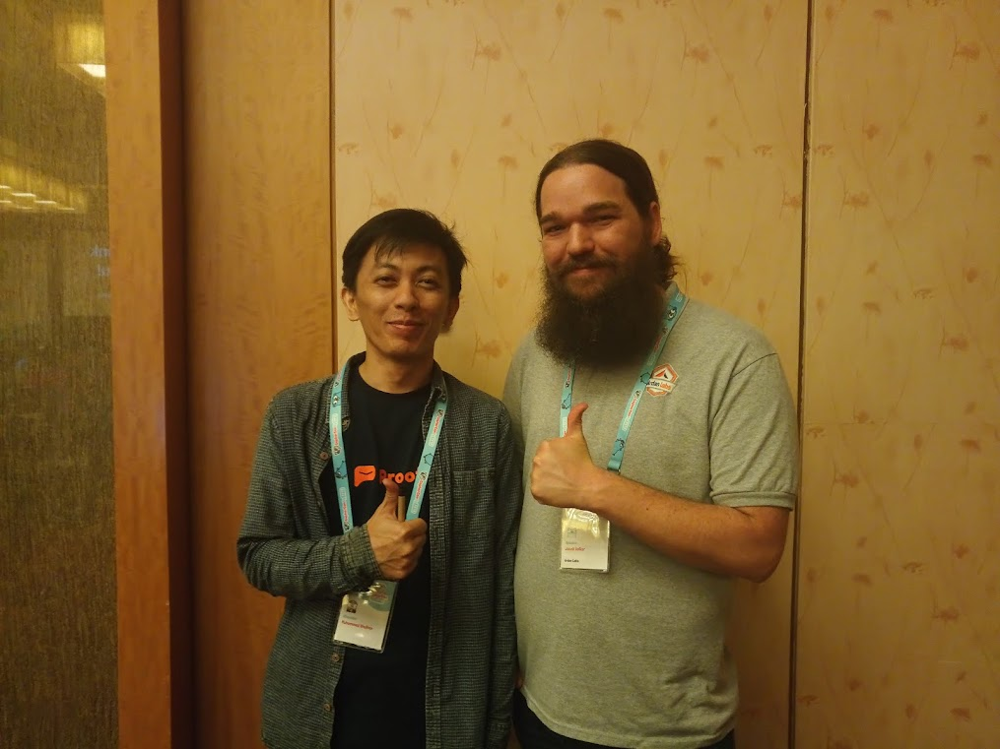
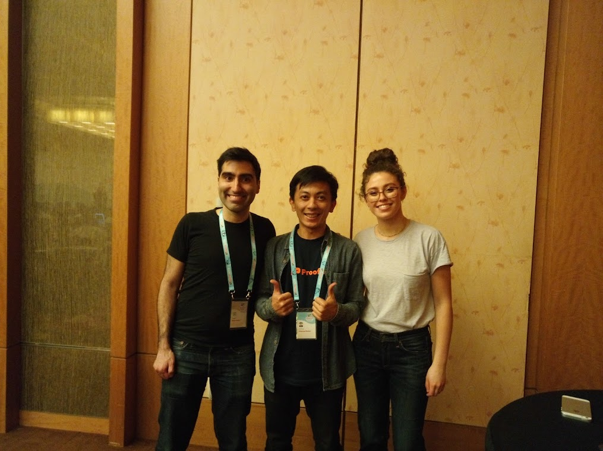

= Gophercon Singapore 2019

I made it!

For GopherCon Singapore 2019 I try to submit two papers.
The first paper is about "Re-learning Slice",

+++
<iframe
	src="https://docs.google.com/presentation/d/e/2PACX-1vTwKUo9uqyMLkJdz5-U9DP6e8Sbx7YFHMSXESwGTN6e5T4qGDcm_nA3qGqhZkUx0x-rEYIE05ZDwpkl/embed?start=false&loop=false&delayms=3000"
	frameborder="0" width="480" height="299" allowfullscreen="true"
	mozallowfullscreen="true" webkitallowfullscreen="true"
></iframe>
+++

and the second paper is about
https://github.com/shuLhan/haminer[haminer: mining HAProxy logs].

+++
<iframe
	src="https://docs.google.com/presentation/d/e/2PACX-1vRusQhz9fx2-Innw4fENdWNLMqSc9HZnLe36QvRmBIdV1hdf0zsgdPu5IMWFPVOsN4BS7vvrFZzOzaf/embed?start=false&loop=false&delayms=3000"
	frameborder="0" width="480" height="299" allowfullscreen="true"
	mozallowfullscreen="true" webkitallowfullscreen="true"
></iframe>
+++

Both are not accepted.
Sad.
But its OK!

My first day of GopherCon is going to workshop at Google Singapore.

.Google Singapore

Actually, this is second day of three days workshop.
I can afford only for single day, so I chose the Dave's session.
The instructor is Mr. Dave "Druid" Cheney ;)
He gave a talk about
https://dave.cheney.net/practical-go/presentations/qcon-china.html[Practical
Go: Real world advice for writing maintainable Go programs], which is
available on his website, for free.
A truly druid.

.Me with Dave `Druid` Cheney

The final day, the conference, is at Marina Bay Sands Expo and Convention
Centre.
There are probably more than 500 gophers attending there,
not only from South East Asia, also from Japan, Austria, and Russia.

.GopherCon Singapore 2019

I met so many awesome people there, enthusiastic gophers, and even
people from @ardanlabs and Go team.

Some of the talks I like are from Jacob Walker,
https://www.youtube.com/watch?v=ZMZpH4yT7M0&list=PLq2Nv-Sh8EbYBYteOWx9rNuy0JSF8mzsu&index=4["Understanding
Allocations: the Stack and the Heap"];

.Hi Jacob!

Michael Matloob,
https://www.youtube.com/watch?v=HDJE-_s3x8Q&list=PLq2Nv-Sh8EbYBYteOWx9rNuy0JSF8mzsu&index=6["Using
and Writing Go Analyses"];
and from Rebecca Stambler,
https://www.youtube.com/watch?v=gZ7N3HulAb0&list=PLq2Nv-Sh8EbYBYteOWx9rNuy0JSF8mzsu&index=9["Go
pls stop breaking my editor"] (the one who responsible for
https://github.com/golang/go/wiki[gopls]).

.Hi @matloob and @stamblerre!

All of the talks are available
https://www.youtube.com/watch?v=ftE39xyaJyQ&list=PLq2Nv-Sh8EbYBYteOWx9rNuy0JSF8mzsu[online].

See you next time GopherCon!
