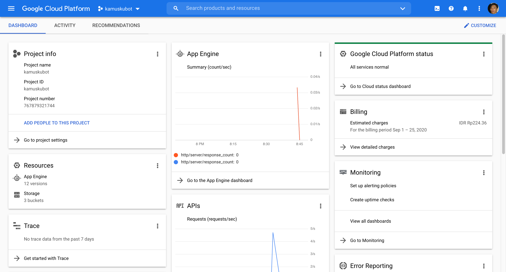
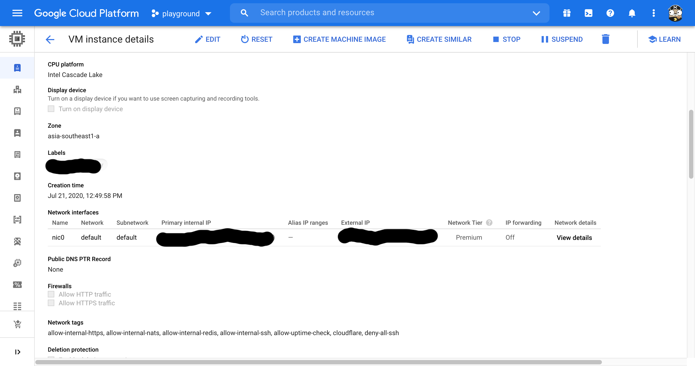

= Things I dislike from Google Cloud Platform
Shulhan <ms@kilabit.info>
25 September 2020
:toc:
:sectlinks:

Google Cloud Platform (GCP) is one of the prominent cloud provider out
there.
With all others Google's products that we praise and we mourned, GCP is
one of them.
In this article I want to rant about things that I dislike with
https://cloud.google.com[GCP console web user interface].

Let's start.

=== The font size

The first thing that I dislike is the font size.
Here is the screenshot that I took on macOS with 13,3-inch (2560 x 1600),
right click and select "View image" if you want to see the full image.

Either I am getting old or the font size is too small for me? Or the
screen size is to wide?

=== The font color

The second thing that I dislike is the font color.
Sometimes its black, most of the times its gray or variation of it.
Maybe they want to make we focus only to the gray text only.

=== The user interface

No offense Google but the layout and user interface design is like written by
first grade computer science.
Here is an example of user interface on details of VM instance.

If I want to "Reset", "Stop", "Suspend" or "Delete" this VM; I would do it in
the previous page, not in here.

At the top of page you will get "Remote access" options, the same
functionality that we also can access from list of VM (before we click the
VM).
And then we got an almost unreadable text "Connect to serial console" and a
checkbox "Enable connecting to serial ports".

The second header is Logs, which if you click on "Cloud logging" you will open
"Logs Viewer" module on THE SAME PAGE, not in another tab.

The third header is "Instance Id", which we (almost) never use actually.
By the way, "Id" should be written and "ID", no? Is it "id" an English word?

The fourth header is "Machine type", followed by others read only information
like "Reservation", "CPU Platform", "Display device" and so on.

The question is, what do we want to do when clicking a VM?
Yes, we want to edit it, and to do that we must click the "Edit" button at the
top.

After we click the "Edit" button the top page is still showing the read-only
information, as the same as previous page.
If you think this is not annoying, then you should stop reading here.

===  We can not edit instance name, once it has created

Once you have create an object like a compute instance, disk, or many other
instances that have name; you can not rename it again later.

===  The logging agent

Scenario #1: you want to centralize logging all your VM/SQL into Logs Viewer.

First step, you must install logging agent into each VM (last time I check, it
is not installed by default).

[blockquote]
When installing the Logging agent, a minimum of 250 MiB memory is required,
but 1 GiB is recommended.

Unfortunately, logging agent only support a Redhat derivate, Debian
derivate, SuSe, and Windows; other than that you must install it from the
source.
The source is not `google-fluentd` but the original `fluentd` from Ruby gem
with additional extension `fluent-plugin-google-cloud`.

Second step, you must add manual configuration and test if its works.

Scenario #2: you want to forward only log with level above warning to
Mattermost/Slack.

First, we must create a "Sink" that forward the filtered logs into a Cloud
Pub/Sub.

Second, we must create a Cloud function to consume the Pub/Sub and forward it
to Mattermost/Slack.

At the end you realize, the logging agent is storing syslog with severity
field, so you did not receive any error on Mattermost/Slack.

===  The monitoring agent

The monitoring agent is an application that send additional metrics to GCP, so
we will get additional information in "Metrics explorer".
Just like the logging agent, this one maybe not installed by default, and only
works on specific Linux distro.

===  The IAM user and SSH keys

By design, each IAM user with level Owner will have their user account on each
VM automatically.
Also by design, each SSH key added to VM will be added as sudoers.

Imagine the scenario where one of your employees is resigned and they have SSH
keys in more than two machines.
You must have to manually remove the SSH keys one by one on each VM.

If we compared this to AWS, managing user and SSH keys on AWS is a lot easier.
AWS also have key rotate recommendation, for example after one year, AWS will
mark the key as "warning" and suggest you to replace it.
None of this practice available on GCP.

--

This list of dislike will be keep growing and updating... Stay updated.
