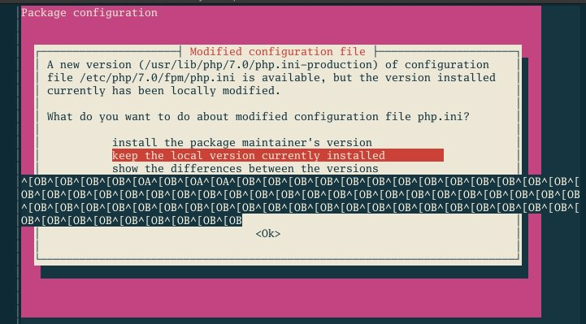

= UNIX/Linux System Administration 101
:author: Shulhan
:date: 25 September 2020

I have seen badly setup Linux server, not once, but many times.
This made me thinking, why?
Does people does not know how to setup Linux server or they just does not have
time?
In this article I will share what I considered best practice when setting UNIX
like server, and at then end I will provide some tips.


== Rule #1: Never run any services as user root

The history of this adage probably comes from multi-user, shared machines,
where two or more users can access one UNIX machine.
If user root run a long running application under its UID, any users on the
same machine may try to exploit it to gain a root access.

This practice still applicable if you have a service that is open to public,
even thought that you are the only user in the machine.

Beside security, one of the reason to not run as user root is to prevent your
application or script or yourself wipe out data accidentally.


== Rule #2: Always use a separated disk for your application

Operating system (OS) and your application should be stored in different disk.
There are two major reason of this.

First, read-write operation will be increased and not affect each other.
A write to log on OS level does not have effect on read operation on
application level.

Second, in case one of OS disk is corrupt, we will only need to recreate new
OS, reinstall the packages, reapply the last good configuration, and reattach
the application disk.
In case on application disk corrupt, we will only need to create new disk and
deploy new application.
But if your OS and application is on the same disk, you need to create OS
and redeploy your application.


== Rule #3: Always have a snapshot of your OS disk (not application)

By having a snapshot, we have a stable packages and configuration that ready
to use, either as quick fix in case of disk corrupt (like in previous case) or
if we want to horizontally scale the application.


== Rule #4: Use public-private key for SSH

Never use password.

Most cloud provider already enforce this practice and I think I have never
seen someone share user:password to access remove server anymore.


== Rule #5: Use screen or tmux for managing multiple sessions

Instead of opening two or more SSH sessions, use screen or tmux to create new
virtual terminal.

I don't remember why, but I prefer tmux over screen (probably window split
features, which screen already have now; or probably the tmux shortcut make
more sense to me).


== Rule #6: Learn about systemd

This is 2020, we are not running application with `nohup` anymore and 
big, major Linux distro already moved from SysV init to systemd.

```
$ man systemd.service
$ man systemd.path
$ man systemd.timer
```


== Rule #7: Use TCP/HTTP proxy

Use TCP/HTTP proxy, do not directly serve your web server to public.

A good proxy will allow load balancing, rate limiting, temporary redirect, and
other flexibility things without touching application code.

This is also provide separation of concern or layer.

Tips: HAProxy is my favourite proxy server.


== Rule #7: Pick a sane GNU/Linux distro.

Choose the one that,

* does not have ads on MOTD,
* does not automatically update the packages,
* does not add new user to sudoers,
* does not prompt with ncurses UI when updating packages.

Ubuntu (or any Debian derivate?) violate all of the above checklists.



If you want additional security and does not have a problem managing SELinux,
use RedHat derivative.
If you want user friendly distro, use SuSE.
If you want latest packages with more flexibility, use Arch.


== Tips

Here is several tips when working with UNIX like system.

===  Use mosh to manage SSH session.

Each time we type a key on SSH, client send the key, server render the screen,
and send the whole text back to client.

Mosh use udp, client did not wait for server to reply before the character
that we type printed on screen.
Also, the data that send by server only the diff, not the whole text.

In summaries, mosh provide faster and network resistance connection for SSH.

===  Use VPN

VPN provide a layer of access for your internal network in the cloud.
Setting up VPN with WireGuard is now easier than ever, but its require latest
(or supported) kernel, both on server and client.

Combine that with DNS server (like
https://git.sr.ht/~shulhan/rescached[rescached^]), we will have a complete
isolate environment with custom internal domain (for example,
myapp.internal).
