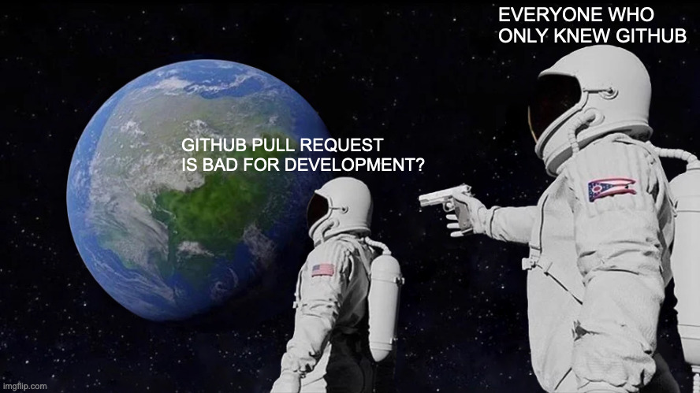
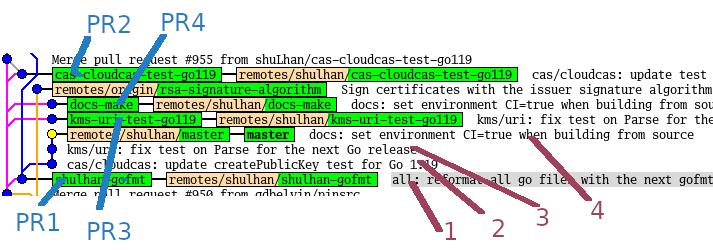
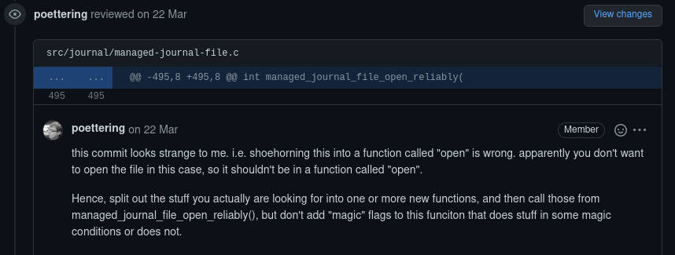
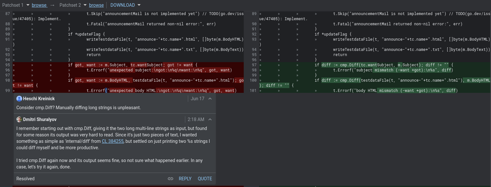
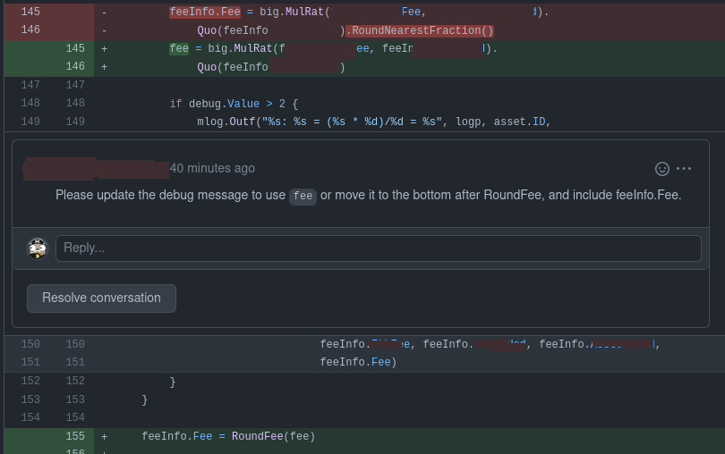
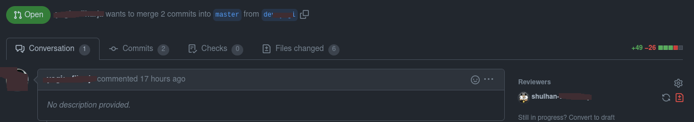
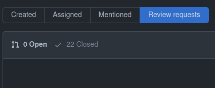
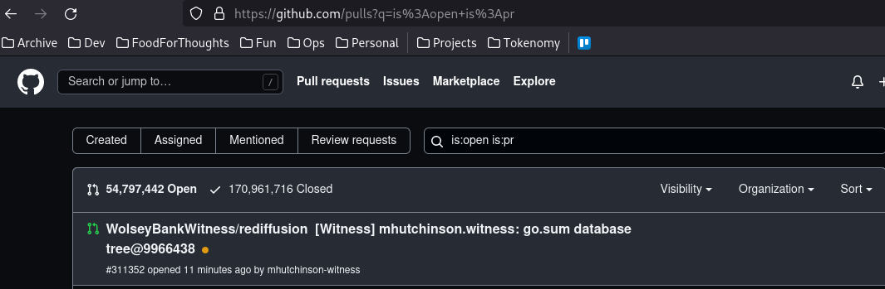

= Things I dislike from Github
Shulhan <ms@kilabit.info>
16 June 2022
:toc:
:sectlinks:

If you active on Internet, you may have read Torvalds rant about how bad
Github pull request (PR) is.
If not, read the discussion
https://news.ycombinator.com/item?id=3960876[here^]
and
https://www.reddit.com/r/programming/comments/tionj/linus_torvalds_doesnt_do_github_pull_requests/[here^].

Actually, it is not only the pull request that is bad.
There are many.
I am collecting those things in these journal.

NOTE: I use the term PR and patches in the same way.

First thing first, remember
link:/journal/2014/04/Holy_github/[this^]?

== You can send patches only by creating fork

Let say you found a bug on repository X.
The only way you send patches to those repo maintainer is by following these
steps,

. create GitHub account,
. fork the origin repository,
. create new branch or push to master,
. push to your fork, and
. open the web and create pull request from the upstream repository.

https://docs.github.com/en/pull-requests/collaborating-with-pull-requests/proposing-changes-to-your-work-with-pull-requests/creating-a-pull-request?tool=cli[GitHub Docs: Creating a pull request^]

== Github pull request flow is really bad

Let me show you.

I have four commits to be submitted to the upstream, each are independent.

To send each of this commit I need to,

. Create new branch based on the `origin/master` branch
. Cherry pick the commits
. Push to my remote
. Open the web, create pull request, select source and target branch, click
  Create; or using `gh pr create`, which is have several steps as for the web.

I need to repeat this steps for every PR.

Things get out of hand if the first branch is indirect dependency of second
branch, because you cannot just based a branch on another branch in the PR,
otherwise all commits in the first branch PR are included in the second PR
branch.

Let me give you an example.

----
D -- branch-2
|
C
|
B -- branch-1
|
A
|
o -- upstream/master
----

If we submit branch-1, commits A and B are displayed on the PR.
If we submit branch-2, that depends on A and B, commits A, B, C, and D are
displayed on the PR (because A and B does not exist yet on `upstream/master`).

Why we are not basing the branch-2 on the upstream/master?
Because it is not possible, the program is not buildable without branch-1.

Why not submit all commits into single branch?
It is possible but in my books
link:/notes/A_guide_to_version_control/[its not a good practices^].
Its hard to review and in case one of the commit need to be revised, I need to
re-base the whole commits
(adding another commit to fix PR also is not a good practices).

Can it be more simple?
Yes, in fact, the
https://git-send-email.io[de facto way^]
to send "pull-request" is really
simple.

This is how it should be.
Lets view all of our commit hashes to be submitted.

----
$ git --no-pager log --oneline -n 4
8fd061dc (HEAD -> master, shulhan/master) docs: set environment CI=true when building from source
0985cbfe kms/uri: fix test on Parse for the next Go release
84a0a348 cas/cloudcas: update createPublicKey test for Go 1.19
fe04f93d all: reformat all go files with the next gofmt (Go 1.19)
----

To send the PRs for commit fe04f93d,

----
$ git send-email --to="recipient@domain.tld" --dry-run -1 fe04f93d
----

(The dry-run options is for testing.)

To send the PRs for the rest of commits, independently,

----
$ git send-email --to="recipient@domain.tld" --dry-run -1 84a0a348
$ git send-email --to="recipient@domain.tld" --dry-run -1 0985cbfe
$ git send-email --to="recipient@domain.tld" --dry-run -1 8fd061dc
----

== Rebasing or ammending the patches break the web history

The more annoying than this is how Github handle reviewing the PR.
If someone review your PR by commenting on the code and you push the fixes
link:/notes/A_guide_to_version_control/[(by git rebase/git ammend)^]
for the next round,
the links between comments and previous patches is lose.

The "View changes" on the comment section open the new commits, not on
previous patches.

Here is an example:

https://github.com/systemd/systemd/pull/22796#discussion_r831375759[Source^].

The comment point to the line that has been fixed by the author.
Now, can you figure it out what the line is from the linked Source?

Compare this with gerrit,

https://go-review.googlesource.com/c/build/+/412754/1..2/internal/task/announce_test.go[Source^].

At the left side you can see the offending code that needs to be fixed (this
is Patchset 1), and on the right side you can see the fixes (Patchset 2).
None of them mixed.

== Reviewing only allowed on affected code

Given the following changes,

User cannot comment on expanded lines 151 that affected by the above changes.

==  Where is the open review?

Another developer create pull request and assign you as the viewer,

But you cannot see it in the
https://github.com/pulls[Pull requests] page,

.

Also, open the following links in your browser: https://github.com/pulls?q=is%3Aopen+is%3Apr

You will see all of the open PR from all repositories is listed.

The URL is "/pulls" but the query still need `is:pr`.
If you remove the `is:pr` field, you will get list of PR and open issues.
Talks about inconsistency.

Update: per 26 January 2023 this issue has been fixed.
The query string in the right add filter for current user as
author/review-requested,

	is:open is:pr author:shuLhan archived:false

* * *

_Thats it for now, will update later when I have more screenshots._
