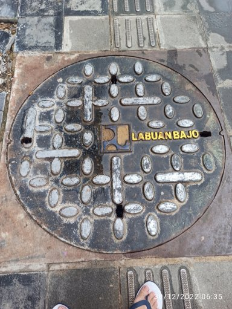
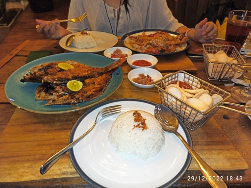

= A trip to Labuan Bajo
Shulhan <ms@kilabit.info>
5 January 2023
:toc:

https://en.wikipedia.org/wiki/Labuan_Bajo[Labuan Bajo] is one of the newest,
rapidly growing tourist destination located in East Nusa Tenggara, Indonesia.

We visit it after the infrastructure already finished, with paved sidewalk
and palm trees on both side.
It's really beautiful and clean.

<<<

In the left you see the underground power line, no more floating cables that
ruin the views on the street anymore.

== When to go?

We visit Labuan Bajo in 28 December and only have chances to dive once and
take island trips once due to bad weather.
As you can see, the picture in the left is taken around 12 PM and its cloudy.

The tour guide suggest that the best time to visit Bajo is on summer.
So do not make the same mistake like us, if you want to go there, make sure
its between April and October.

== Where to stay?

Around Labuan Bajo there various hostel and hotel, from 1 to 5 stars; from
200K IDR per night to 12000K IDR.
The average hotel per night is around 500K and can goes to 1000K IDR on the
peak season.

We stay at Seaesta and did not regret it.
They have hostel with 200K per night and private room with around 800-1000K
per night.
At the roof top, they have restaurant and bar with live DJ or band at night.

== Where to go?

===  Diving

Bajo is famous for its island and diving views.
Even if you are never done diving before, you must try and experiences in
here.
The cost for diving is around 2500K IDR for discovery (beginner) with 2 times
dives.
If you were lucky, you can see turtle, small shark, and manta ray.

=== Snorkeling and island jumps

Most of tour shop around the Soekarno-Hatta street provide a One-day trip
packet for snorkeling and visiting islands.
The trip cost around 1450K IDR per person, not including the ticket for
Komodo National Park 100K for local 250K for foreigner.
You can visit six locations (see the image in the right), four for snorkeling,
one for hiking, and one for seeing komodo.

Unfortunately, in our trip we can only visit three locations due to bad
weather.

For reference, you can contact our friendly local, Fransisco Erwin at
+6281219695388.
He help and guide us to find the tour boat, souvenir shops, and place to eat
during our last day there.

=== Hiking: Bukit near Savanna Hill

https://goo.gl/maps/35rMRrikDXVWqvp49[Google maps].

We actually want to go Sylvia Hill but got lost and end up in this hill.

[.Bukit near Savanna Hill]
video::EQg01vzcxZQ[youtube,width=640,height=320].

===  Mirror stone cave

https://goo.gl/maps/WWefycTiB5G4EAZJ7[Google maps].

You can go to this place using motorbike or car.
It take around 30 minutes or less from harbor.

Long, long time ago this cave is filled with sea water.
Inside the cave, you can see the prehistoric coral, stalagmites, and
stalactite.

===  Rangko cave

https://goo.gl/maps/NBJHwoba6QWmcrGM9[Google maps].

After visiting Mirror stone cave, you can continue to the east to visit the
Rangko cave.
To go to Rangko cave you need a boat since there is no road there.
The boat can be rented at
https://goo.gl/maps/fKBYtt2XB7bEFB7B9[Site RKTG - Rangko]
for 300K per boat.
It takes around 30 minutes from Mirror stone cave and around 10 minutes from
beach to the cave.

=== Overland tour

Beside their ocean and underwater views, this island also have beautiful land
views and culture.
We have not tried this but it is one in our check list.

There are several packets for overland tour, from one day trip to four days
trips.
Of course the price and the locations also different for each of them.
Our recommendation is take the four or five day trips so you can see how
gorgeous this island is.

== What to eat?

Five days before we departure, we got a very bad diarrhoea and hospitalized
for two days in Bandung.
On the first day in Labuan Bajo we still take antibiotics, so we take
precautions on what we eat there.

From our experiences, the food prices here is normal with Java, you can eat
from 10K IDR to 200K.
The average food prices here, if you eat in restaurant, is around 60-80K IDR;
with beverages is around 20-40K IDR.

For breakfast you can buy "Nasi Kuning" in
https://goo.gl/maps/DWW1EJYPh7AroHue9[here],
started from 10K IDR.
They also sell desert or traditional cakes.

For lunch, if you like spicy food, you can go to Padang restaurants near
Soekarno-Hatta street with price around 20-50K IDR depends on your main
course.

Also, do not forget to try their famous Se'i -- smoked red meat, beef or
pork.

The list below is for restaurants that we have visited.

===  Seaesta restaurant and bar

https://goo.gl/maps/4eFFET7hsPRs3SQh6[Google maps]

In this restaurant you can go for breakfast, lunch, or dinner.
The price is around 60-120K for food and 30-120K for beverages (including
cocktails).

===  Taman Laut Handayani

https://goo.gl/maps/bXjBkiugbdS6Q92v8[Google maps]

The best time for eat here is at dinner, or after 5 PM if you want to view
sunset.
They serve mostly seafood and Indonesian culinary.

This place have two floors, one for VIP and closed area and one with half-open
roof top with view to harbor.

===  Green Cherry

https://goo.gl/maps/cWQteyQgGkvLqhbx9[Google maps]

Also the best time for eat here is at dinner.
It has great view to harbor.

The food is alright, good services, and great atmosphere.

===  Artomoro

https://goo.gl/maps/MFT43CsyEz3PsjocA[Google maps].

Artomoro is quite unique, they have Javanese style cuisine, and somehow match
with our tongue.
Their grilled fish and prawns are one of the best in Labuan Bajo.

A little bit history, from word of mouth, this restaurant start from small
tavern.
The owner is from Javanese (which explain a lot about their tastes) and
probably get quite famous and now owned a coffee shop, a hotel, and a
restaurant.

===  Pondok Mai Ceng'go Labuan Bajo

https://goo.gl/maps/m4Z7u2yFJLTqC89E9[Google maps].

Located near airport, Pondok Mai Ceng'go serve local, Indonesian cuisine.

With 300K you can eat for four.

The food is great the only issue is lack of taste especially in sambal. They
provide three sambal, one sambal lado (chilli sauce, the hot one), one sambal
bawang (onion sauce), and another one is sambal matah.

If you sit below, bottom floor, sometimes you can smell unpleasant odor from
behind, probably from river or something.

===  Atlantis Beach Club

https://goo.gl/maps/1RXAiQoZvWMY1CmGA[Google maps].

One of the restaurant owned by Plataran group that mixed the Boat and Joglo
house (Javanese style house).
Not sure what is the main theme here.

As part of Plataran chain restaurants, they keep the taste to the local
tongue.

They have indoor and outdoor rooms but with different themes. The outdoor one
looks like a ship and the indoor one is joglo (java style home, I believe)
which I think out of place considering we are in Flores.

Unlike the other place, this place is quite expensive depends on your
menu selection.

===  Atlantis On The Rock

https://goo.gl/maps/dB3r9QXM5eabdMaRA[Google maps].

image:atlantis_on_the_rock.jpg[Atlantis on the rock,320,role=right]
For the last dinner at Labuan Bajo, we go to Atlantis On The Rock.

The best time for dinner is after 5 PM, so you can view the sunset.
Unfortunately, the wind is quite strong that night so we need to move inside.

For the taste, I think this is one of the best but it also come with the
price.
