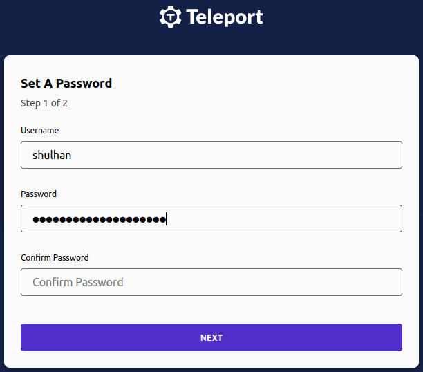
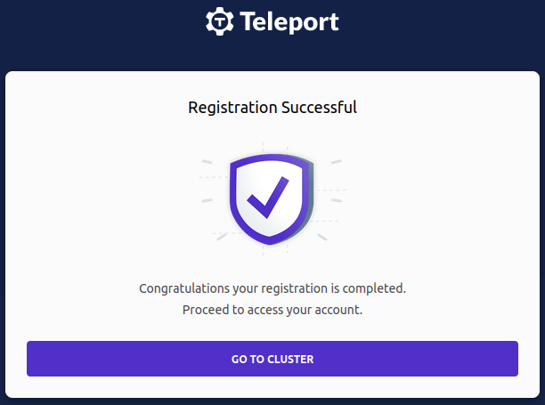

= Research on SSH with 2FA
Shulhan <ms@kilabit.info>
October 2023
:toc:
:sectanchors:

In this journal, we review several options to manage SSH authorization
beyond using public keys, possibly also enabling 2FA, using
https://tools.ietf.org/html/rfc6238[Time-Based One-Time Password^] (TOTP).
Some of the alternatives that we will review are Google Cloud OS Login,
Smallstep, Teleport, and google-authenticator-libpam.

== Environment
//{{{

Our environment is located in Google Cloud Platform (GCP).
The following diagram show the simplified infrastructure,

----
                                Google Cloud
                              /-------------------------\
                              |    vpn.internal         |
 +--------+   WireGuard VPN   |   +----------------+    |
 | Client | <-------------------> | DNS/VPN server |    |
 +--------+   10.8.0.0/24     |   +----------------+    |
                              |     ^                   |
                              |     | 10.148.0.0/16     |
                              |     v                   |
                              |   +----+                |
                              |   | VM | test.internal  |
                              |   +----+                |
                              \-------------------------/
----

For a client to be able to connect to VM,

* first they need to connect Virtual Private Network (VPN) server
  `vpn.internal`, and
* then connect to virtual machine (VM) `test.internal`, through their
  internal IP address using Secure SHell (SSH) with private key.

The VPN server also act as router and firewall.
Once the client connect to VPN, only specific list of internal IPs that they
can access, filtered by firewall.

The SSH public key is propagated in the VM metadata (which eventually
updated by GCP into the VM).

So, based on current environment, to add or remove user from accessing
SSH in a VM, we need two steps:
adding public key to Compute Engine metadata and updating the firewall.

//}}}

== Requirements
//{{{

Our objectives in this research is that,

* when user connect to VM using SSH, they need to input a second
  authentication, probably using TOTP -- six digits number that are
  generated randomly from a know key and time.

* minimize SSH keys management

If we will use third-party application, it should be Free/Open Source
Software.

//}}}
== Setting up awwan
//{{{

We will use
https://git.sr.ht/~shulhan/awwan[awwan^]
as the provisioning tool along with
https://cloud.google.com/cli?hl=en[Google Cloud CLI^].

Lets assume that the domain name of our VPN server is "vpn.internal" and the
test VM for SSH is "test.internal".

Lets setup awwan workspace by creating ssh_config(5),

----
$ mkdir -p .ssh
$ cat >.ssh/config <<EOF
Host vpn.internal
    Hostname <Internal IP address>
    User <SSH user name>
    IdentityFile <Path to your private key>

Host test.internal
    Hostname <Internal IP address>
    User <SSH user name>
    IdentityFile <Path to your private key>
EOF
$ mkdir -p vpn.internal
$ mkdir -p test.internal
----

Note that, any commands later that start with "$" is executed manually,
while other commands is part of script executed with awwan.

//}}}

== OS Login
//{{{

Since we are on GCP, my first thought is to experiment using the "OS Login".
According to
https://cloud.google.com/compute/docs/oslogin[OS Login documentation^],
if its enabled, it can provide

[quote]
____
Integration with Google Account two-step verification - You can optionally
require that OS Login users validate their identity using one of the
following 2-step verification methods or challenge types when connecting to
VMs:

* https://support.google.com/accounts/answer/1066447[Google Authenticator^]
* Text message or phone call verification
* Phone prompts
* Security key one-time password (OTP)
____

Google Authenticator is a mobile application that can generate TOTP code.

Lets assume that we already have a VM running in the GCP to test this setup.
The next sections contains steps to setup OS Login.

//}}}
=== Assign OS Login IAM roles
//{{{

Reference: https://cloud.google.com/compute/docs/oslogin/set-up-oslogin#configure_users

Assign all of the required IAM roles to users who connect to VMs that have
OS Login enabled,

----
#require: gcloud config configurations activate {{.Val "gcloud::config"}}

#[[[ Add roles to instances.

gcloud compute instances add-iam-policy-binding {{.Val "host::name"}} \
    --zone={{.Val "gcloud::zone"}} \
    --member=domain:{{.Val "gcloud:member:domain"}} \
    --role=roles/compute.osLogin

#]]]
#[[[ Dump the IAM policy for future auditing.

gcloud compute instances get-iam-policy {{.Val "host::name"}} \
    --zone={{.Val "gcloud::zone"}} \
    --format=json \
    > {{.ScriptDir}}/iam-policy.json

#]]]
----

After applying the above scripts, our "iam-policy.json" should looks like
these,

----
{
  "bindings": [
    {
      "members": [
        "domain:example.com"
      ],
      "role": "roles/compute.osLogin"
    }
  ],
  "etag": "BwYHfTkMN7M=",
  "version": 1
 }
----

//}}}
=== Enable OS Login
//{{{

Reference: https://cloud.google.com/compute/docs/oslogin/set-up-oslogin#enable_os_login

Add the "enable-oslogin" and "enable-oslogin-2fa" metadata to the VM,

----
#require: gcloud config configurations activate {{.Val "gcloud::config"}}

#...<TRUNCATED>...

#[[[ Add OS Login metadata.

gcloud compute instances add-metadata {{.Val "host::name"}} \
    --zone={{.Val "gcloud::zone"}} \
    --metadata enable-oslogin=TRUE,enable-oslogin-2fa=TRUE

#]]]
#[[[ Dump instance metadata for future audit.

gcloud compute instances describe {{.Val "host::name"}} \
    --zone={{.Val "gcloud::zone"}} \
    --format=json \
    > {{.ScriptDir}}/instance.json

#]]]
----

The "instance.json" after we apply the above commands should changes like
these,

----
   "machineType": "https://www.googleapis.com/compute/v1/projects/playground-185301/zones/asia-southeast1-a/machineTypes/f1-micro",
   "metadata": {
-    "fingerprint": "PCVKx-xORSI=",
+    "fingerprint": "_deVUvjp-JY=",
     "items": [
       {
         "key": "block-project-ssh-keys",
         "value": "TRUE"
       },
+      {
+        "key": "enable-oslogin",
+        "value": "TRUE"
+      },
+      {
+        "key": "enable-oslogin-2fa",
+        "value": "TRUE"
+      },
       {
         "key": "ssh-keys",
----

//}}}
=== Add keys to VMs that use OS Login
//{{{

Reference: https://cloud.google.com/compute/docs/connect/add-ssh-keys#os-login

In this step we add a public SSH key into our Google account using the
gcloud CLI.

----
#require: gcloud config configurations activate {{.Val "gcloud::config"}}

#...<TRUNCATED>...

gcloud compute os-login ssh-keys add \
    --key-file=/path/to/public/key/file
----

Unfortunately this does not works,

----
ERROR: (gcloud.compute.os-login.ssh-keys.add) User [<REDACTED>] does not
have permission to access users instance [<REDACTED>:importSshPublicKey] (or
it may not exist): Insufficient IAM permissions.
The instance belongs to an external organization. You must be granted the
roles/compute.osLoginExternalUser IAM role on the external organization to
configure POSIX account information.
!!! exit status 1
----

//}}}
=== Conclusion: does not works due to out of control
//{{{

Seems like to be able to use OS Login in GCP, first I must be a Google
Workspace administrator, as defined in
https://cloud.google.com/compute/docs/oslogin/manage-oslogin-in-an-org[Manage
OS Login in an organization^] documentation.
Unfortunately, I cannot and does not have access to that.
Being an administrator of Google Workspaces and Google Cloud Platform at the
same time is quite big responsibilities.
Not sure why Google tied all those two together, they should not overlapping
with each others.

Also, the project must be under Organization.
Meanwhile our project is still under "No Organization".

//}}}

== Smallstep
//{{{

https://smallstep.com[Smallstep^]
is "End-to-end encryption for distributed applications and the people who
manage them."

The reason why we include Smallstep in this list because of this article:
https://smallstep.com/blog/diy-single-sign-on-for-ssh/[DIY Single Sign-On
for SSH^].
There are two applications provides by Smallstep, one is
https://github.com/smallstep/certificates["certificates"^]
(or step-ca), an online Certificate Authority (CA) for secure, automated
X.509 and SSH certificate management; and another one is
https://github.com/smallstep/cli["cli"^]
the command line interface to communicate with step-ca and as wrapper for
other tools.
Both are Free Software under Apache-2.0 license.

In those article the SSH connection is authorized using third party
provider, Google OpenID Connect (OIDC).
The second factor authentication _maybe_ available if the user enable it on
their Google account.
They use Amazon EC2, while in this article we will use combination of X.509
(X5C) and ACME.

Lets try it.

//}}}
=== Create Google OAuth 2.0 credential
//{{{

Follow the instruction in

* https://smallstep.com/blog/diy-single-sign-on-for-ssh/#1-create-a-google-oauth-credential[Create
  a Google OAuth Credential^], and
* https://support.google.com/cloud/answer/6158849?hl=en-GB#zippy=%2Cnative-applications[Setting up OAuth 2.0^]

Create new hidden awwan environment to store our client ID and secret in
"vpn.internal/.awwan.env",

----
$ mkdir -p vpn.internal
$ cat >vpn.internal/.awwan.env <<EOF
[smallstep]
google_oauth2_id = # Put Google OAuth2.0 client ID here.
google_oauth2_secret = # Put Google OAuth2.0 client secret here.
EOF
----

//}}}
=== Setup CA server
//{{{

This setup is done in VPN server.

First, we create non-secret "awwan.env", add CA name, list of domain names
and IP address for root certificate.

----
$ cat >vpn.internal/awwan.env <<EOF
[gcloud]
project = ... # Your GCP project ID.

[smallstep]
ca_path = /etc/step-ca
ca_name = Mycompany # A name for your CA.
ca_dns = vpn.internal, 10.184.0.8 # The DNS name or IP address of the new CA.
ca_provisioner = ms@kilabit.info
ca_address = :8443 # HTTP address served by step CA server.

## Domain names allowed to authenticated using our OAuth2.0 client.
google_oauth2_domains = gmail.com
EOF
----

Create a file to store step-ca configuration and root password in our local
first,

----
$ mkdir -p vpn.internal/etc/step-ca/config
$ mkdir -p vpn.internal/etc/step-ca/templates/ssh
$ echo -n "<FILL IT>" > vpn.internal/etc/step-ca/step-ca-password.txt
----

Encrypt the password and hidden awwan environment files, and then remove it,

----
$ awwan encrypt vpn.internal/.awwan.env
$ awwan encrypt vpn.internal/etc/step-ca/step-ca-password.txt
$ rm vpn.internal/.awwan.env
$ rm vpn.internal/etc/step-ca/step-ca-password.txt
----

Create bash profile for step-ca path,

----
$ mkdir -p vpn.internal/etc/profile.d/
$ cat >vpn.internal/etc/profile.d/step-ca.sh <<EOF
export STEPPATH={{.Val "smallstep::ca_path"}}
EOF
----

Create systemd service to run our step-ca server,

----
$ mkdir -p vpn.internal/etc/systemd/system
$ echo >vpn.internal/etc/systemd/system/step-ca.service <<EOF
[Unit]
Description=step-ca service
After=network.target

[Service]
Type=simple
Restart=always
RestartSec=5
Environment=STEPPATH={{.Val "smallstep::ca_path"}}
ExecStart=/usr/bin/step-ca {{.val "smallstep::ca_path"}}/config/ca.json --password-file={{.Val "smallstep::ca_path"}}/step-ca-password.txt

[Install]
WantedBy=multi-user.target
EOF
----

Create script "vpn.internal/00_smallstep.aww" to install and setup the
step CA server.
The following paragraphs are break down of the script step by step.

Note that In Arch Linux, the cli binary name is "step-cli" not "step".

Step 1) Install step-ca and step-cli packages,

----
sudo pacman -Sy --noconfirm step-cli step-ca
----

Step 2) Bootstrap the CA,

----
sudo mkdir -p {{.Val "smallstep::ca_path"}}
sudo chmod 0700 {{.Val "smallstep::ca_path"}}

#put! {{.ScriptDir}}/etc/profile.d/step-ca.sh \
    /etc/profile.d/step-ca.sh
sudo chmod +x /etc/profile.d/step-ca.sh

#put! {{.ScriptDir}}/etc/step-ca/step-ca-password.txt \
    {{.Val "smallstep::ca_path"}}/step-ca-password.txt

STEPPATH={{.Val "smallstep::ca_path"}}; \
    sudo -E step-cli ca init \
    --ssh \
    --name="{{.Val "smallstep::ca_name"}}" \
    --dns="{{.Val "smallstep::ca_dns"}}" \
    --address="{{.Val "smallstep::ca_address"}}" \
    --provisioner="{{.Val "smallstep::ca_provisioner"}}" \
    --password-file="{{.Val "smallstep::ca_path"}}/step-ca-password.txt"
----

Step 3) Add the Google OAuth provisioner, for user certificates,

----
export STEPPATH={{.Val "smallstep::ca_path"}}; \
    sudo -E step-cli ca provisioner add Google \
    --type=oidc \
    --ssh \
    --client-id={{.Val "smallstep::google_oauth2_id"}} \
    --client-secret={{.Val "smallstep::google_oauth2_secret"}} \
    --configuration-endpoint="https://accounts.google.com/.well-known/openid-configuration" \
    --domain="{{.Val "smallstep::google_oauth2_domains"}}"
----

Step 4) Add sshpop provisioner to let hosts renew their ssh certificates,

----
export STEPPATH={{.Val "smallstep::ca_path"}}; \
    sudo -E step-cli ca provisioner add SSHPOP --type=sshpop --ssh
----

Step 5) Add X5C provisioner,

----
export STEPPATH={{.Val "smallstep::ca_path"}}; \
    sudo -E step-cli ca provisioner add x5c --type X5C \
        --x5c-roots {{.Val "smallstep::ca_path"}}/certs/root_ca.crt
----

Step 6) Add ACME provisioner,

----
export STEPPATH={{.Val "smallstep::ca_path"}}; \
    sudo -E step-cli ca provisioner add acme --type ACME
----

Step 7) Backup our step-ca configurations,

----
#get! /etc/step-ca/config/ca.json \
    {{.ScriptDir}}/etc/step-ca/config/ca.json

#get! /etc/step-ca/templates/ssh/config.tpl \
    {{.ScriptDir}}/etc/step-ca/templates/ssh/config.tpl
----

Step 8) Install and setup systemd service.

----
#put! {{.ScriptDir}}/etc/systemd/system/step-ca.service \
    /etc/systemd/system/step-ca.service

sudo chmod 0600 /etc/systemd/system/step-ca.service

sudo systemctl daemon-reload

sudo systemctl enable step-ca.service
sudo systemctl restart step-ca.service
sudo systemctl status step-ca.service
----

See the following
link:bootstrap_step-ca.txt[log file^]
to view output of above steps.

Copy the "X.509 Root Fingerprint" from the output of "systemctl status
step-ca.service", put it in "vpn.internal/awwan.env",

----
[smallstep]
<TRUNCATED>
ca_fingerprint = 350960247<TRUNCATED>
----

//}}}
=== Setup SSH server
//{{{

WARNING: If you misconfigured SSH server, you may be locked up and not
be able revert the changes again.
The best practice is to open one session in the background before applying
any changes.

In this section, we setup SSH server in "test.internal" to use our CA and
host certificate.

In the VM we needs to define several variables, the internal domain name of
VM, the local hostname, the internal IP address, CA URL, and CA fingerprint.

Lets store it in the "test.internal/awwan.env",

----
$ mkdir -p test.internal/
$ cat >test.internal/awwan.env <<EOF
[host]
name = test
domain = test.internal
ip_internal = 10.148.0.134

[smallstep]
ca_path = /etc/step-ca
ca_url = https://10.184.0.8:8443
ca_fingerprint = 350960247<TRUNCATED>
EOF
----

Create script to setup it in "test.internal/00_smallstep.aww" that we
run on the server using awwan.
The following are break down of script step by step.

Step 1) Install step CLI

Note, in Arch Linux, the cli binary name is "step-cli" not "step".

----
sudo pacman -Sy --noconfirm step-cli

sudo mkdir -p {{.Val "smallstep::ca_path"}}
sudo chmod 0700 {{.Val "smallstep::ca_path"}}
----

Step 2) Fetch the CA's root certificate so we can talk to it later with TLS.

----
export STEPPATH={{.Val "smallstep::ca_path"}}; \
    sudo -E step-cli ca bootstrap \
        --ca-url {{.Val "smallstep::ca_url"}} \
        --fingerprint {{.Val "smallstep::ca_fingerprint"}}
----

Step 3) Install the CA cert for validating user certificates (from
"/etc/step-ca/certs/ssh_user_key.pub" on the CA).

----
export STEPPATH={{.Val "smallstep::ca_path"}}; \
    sudo -E sh -c \
    "step-cli ssh config --roots \
    > {{.Val "smallstep::ca_path"}}/certs/ssh_user_key.pub"
----

Step 4) Request for host certificate using ACME to our CA.

When you issue this command, the step-cli command will open and listen to
port 80 for the CA server to validate the request.
In the CA server, we need to configure "/etc/hosts" so that the domain
"test.internal" is translated to correct IP address.
For example, I added "10.148.0.134 test.internal" to "/etc/hosts" in the CA
server.

----
export STEPPATH={{.Val "smallstep::ca_path"}}; \
    sudo -E sh -c "\
        step-cli ca certificate test.internal \
            {{.Val "smallstep::ca_path"}}/certs/internal.crt \
            {{.Val "smallstep::ca_path"}}/certs/internal.key \
            --provisioner=acme \
    "
----

Step 5) Generate SSH host certificate,

----
export STEPPATH={{.Val "smallstep::ca_path"}}; \
    sudo -E sh -c "\
        step-cli ssh certificate \
            test.internal \
            {{.Val "smallstep::ca_path"}}/ssh_host \
            --host \
            --no-password \
            --insecure \
            --provisioner=x5c \
            --x5c-cert={{.Val "smallstep::ca_path"}}/certs/internal.crt \
            --x5c-key={{.Val "smallstep::ca_path"}}/certs/internal.key \
       "
----

The above command generate SSH private key, public key, and
certificate: "/etc/step-ca/certs/ssh_host",
"/etc/step-ca/certs/ssh_host.pub", and
"/etc/step-ca/certs/ssh_host-cert.pub".

Step 6) Create SSHD configuration to authenticate using host and CA
certificates in "test.internal/etc/ssh/sshd_config.d/stepca.conf".

----
## This is the CA's public key, for authenticating user certificates:

TrustedUserCAKeys {{.Val "smallstep::ca_path"}}/certs/ssh_user_key.pub

## This is our host private key and certificate:

HostKey /etc/ssh/ssh_host_ecdsa_key
HostCertificate /etc/ssh/ssh_host_ecdsa_key-cert.pub
----

Update the "sshd_config" to include files in "/etc/ssh/sshd_config.d/",

----
<TRUNCATED>

Include /etc/ssh/sshd_config.d/*.conf
----

Step 7) Copy the SSHD configuration to remote server.

----
#put! {{.ScriptDir}}/etc/ssh/sshd_config.d/stepca.conf \
    /etc/ssh/sshd_config.d/stepca.conf

#put! {{.ScriptDir}}/etc/ssh/sshd_config /etc/ssh/sshd_config
----

Step 8) Restart SSH server.

----
sudo sshd -t
sudo systemctl restart sshd.service
----

Step 9) Create new user that match with Google's email.
For example if your Google email is "john.doe@gmail" then the username
should be "johndoe".

----
sudo useradd -m \
    --password='$2a$10$<REDACTED>' \
    {{.Val "smallstep:user-map:shulhan"}}
----

link:bootstrap_step_vm.txt[Log of script when executed from top to bottom^].

//}}}
=== Setup SSH client
//{{{

In your local machine, we bootstrap the step CA and SSH client.
We don't use awwan here, but execute the command manually, one by one.

Step 1) Bootstrap the local step CA,

----
$ step ca bootstrap \
    --ca-url=https://10.184.0.8:8443 \
    --fingerprint=350960247<REDACTED>
The root certificate has been saved in /home/ms/.step/certs/root_ca.crt.
The authority configuration has been saved in /home/ms/.step/config/defaults.json.
----

Step 2) Login to Google to get SSH certificate,

----
$ step ssh login [your email address] --provisioner "Google"
✔ Provisioner: Google (OIDC) [client: <REDACTED>.apps.googleusercontent.com]
Your default web browser has been opened to visit:

https://accounts.google.com/o/oauth2/v2/auth?<REDACTED>

✔ CA: https://10.184.0.8:8443
✔ SSH Agent: yes
----

Lets see list of keys in our agent,

----
$ ssh-add -l
256 SHA256:zuoVdI2sPDE0Qqintg27lwpSD3R+Ya0R/cznB0VbWWY muhammad.shulhan@<REDACTED> (ECDSA-CERT)
----

Step 3) Configure ssh to use our CA,

----
$ step-cli ssh config
✔ /home/ms/.ssh/config
✔ /home/ms/.step/ssh/includes
✔ /home/ms/.step/ssh/config
✔ /home/ms/.step/ssh/known_hosts
----

The following snippet is added to our ".ssh/config",

----
# autogenerated by step @ 2023-10-20T07:00:44Z
Host *
    Include "/home/ms/.step/ssh/includes"
# end
----

Step 4) Test SSH to remote server,

----
$ ssh -v test.internal
OpenSSH_9.5p1, OpenSSL 3.1.3 19 Sep 2023
debug1: Reading configuration data /home/ms/.ssh/config
<REDACTED>
debug1: /home/ms/.ssh/config line 126: Applying options for *
debug1: Reading configuration data /home/ms/.step/ssh/includes
debug1: Reading configuration data /home/ms/.step/ssh/config
debug1: Executing command: 'step ssh check-host test.internal'
debug1: Reading configuration data /etc/ssh/ssh_config
debug1: /etc/ssh/ssh_config line 2: include /etc/ssh/ssh_config.d/*.conf matched no files
debug1: Executing proxy command: exec step ssh proxycommand shulhan test.internal 22
<TRUNCATED>
debug1: Server host certificate: ecdsa-sha2-nistp256-cert-v01@openssh.com SHA256:MwcK+/UqKqo61xANeXRfwCJ817x3iwmEoT67yHcPsO4, serial 17653158930487898804 ID "test.internal" CA ecdsa-sha2-nistp256 SHA256:4r+Nqd9G8nrq6HfvE6YvWqRpkEPLYUdentwTjX7nDuw valid from 2023-10-20T16:02:12 to 2023-10-21T15:54:27
debug1: load_hostkeys: fopen /etc/ssh/ssh_known_hosts: No such file or directory
debug1: load_hostkeys: fopen /etc/ssh/ssh_known_hosts2: No such file or directory
debug1: Host 'test.internal' is known and matches the ECDSA-CERT host certificate.
debug1: Found CA key in /home/ms/.step/ssh/known_hosts:1
debug1: get_agent_identities: agent returned 2 keys
debug1: Will attempt key:  ED25519 SHA256:hg/o6rk9V0498Hk69O7WM66A/+X5BVmEp1ffoA05rh0 agent
debug1: Will attempt key: shulhan@<REDACTED> ECDSA-CERT SHA256:Czvq8f+3tmtfYhznXA3RXi0pGkFgklBaBPO050/8peY agent
<TRUNCATED>
debug1: Server accepts key: shulhan@<REDACTED> ECDSA-CERT SHA256:Czvq8f+3tmtfYhznXA3RXi0pGkFgklBaBPO050/8peY agent
debug1: sign_and_send_pubkey: no separate private key for certificate "shulhan@<REDACTED>"
Authenticated to test.internal (via proxy) using "publickey".
debug1: channel 0: new session [client-session] (inactive timeout: 0)
debug1: Requesting no-more-sessions@openssh.com
debug1: Entering interactive session.
debug1: pledge: proc
debug1: client_input_global_request: rtype hostkeys-00@openssh.com want_reply 0
debug1: Remote: cert: key options: agent-forwarding port-forwarding pty user-rc x11-forwarding
debug1: Remote: cert: key options: agent-forwarding port-forwarding pty user-rc x11-forwarding
debug1: pledge: fork
Last login: Fri Oct 20 09:25:25 2023 from 10.184.0.8
[shulhan@test.internal ~]$
----

We are in!

//}}}
=== Conclusion ⭐⭐
//{{{

Setting up Smallstep CA server, SSH server, and SSH client is quite long,
it takes me several days.
First by experiment using GCP as
https://docs.aws.amazon.com/AWSEC2/latest/UserGuide/instance-identity-documents.html[Instance
Identitity Documents (IID)]
and failed (somethings about subject/domains not exist in generated token).
Second times by using combination of X5C and ACME providers.

We finally able to SSH using Google Account but there is no 2FA even
thought we enable them.

The documentation that provides by Smallstep is not intuitive enough, most
of the time I figured it out by trial-and-error.

The way that Smallstep SSH works, by modifying SSHD configuration is a
little bit off for me.
It may breaks most of our auto deployment, I have not found a clue how to
exclude certain user (bot/deployment user) from not using Google
provisioner.
Like I mention earlier, the documentation does not broad enough to cover
this issue.

//}}}

== Teleport
//{{{

Reference: https://goteleport.com/docs

Teleport is

[quote]
DevOps teams use Teleport to access SSH and Windows servers, Kubernetes,
databases, AWS Console, and web applications.
Teleport prevents phishing by moving away from static credentials towards
ephemeral certificates backed by biometrics and hardware identity, and stops
attacker pivots with the Zero Trust design.

Teleport provides a community edition, a free software under Apache 2
license.

Based on quick glance on their documentation, we need to setup three
services: Teleport Proxy service, Teleport Auth service, and Teleport agent
service in each VM.

For testing, we can setup the Teleport Proxy and Auth services in single
instance, in our environment it will live on the same instance as our VPN
and DNS server.
The Teleport agent service will be installed on each VM that we want to
access using SSH.

----
                                Google Cloud
                              /------------------------------\
                              |    vpn.internal              |
 +--------+   WireGuard VPN   |   +-----------------------+  |
 | Client | <-------------------> | DNS+VPN server        |  |
 +--------+   10.8.0.0/24     |   | / Teleport proxy+auth |  |
                              |   +-----------------------+  |
                              |     ^                        |
                              |     | 10.148.0.0/16          |
                              |     v                        |
                              |   +-----------------------+  |
                              |   | SSHD                  |  |
                              |   | / Teleport agent      |  |
                              |   +-----------------------+  |
                              |    test.internal             |
                              \------------------------------/
----

Remember that, all the commands in the next sections is written using
perspective of https://awwan.org[awwan], unless it begin with "$" that means
run it manually in terminal.

//}}}
===  Setup root Certificate Authority
//{{{

In my environment, I already have self signed Certificate Authority
(CA) created using
https://github.com/FiloSottile/mkcert[mkcert].

I will try to replicate how to create it here (some commands not tested, so
it may not works correctly).

Step 1) Install mkcert.

Step 2) Create root CA,

----
#local: mkdir {{.BaseDir}}/ca

#local: CAROOT={{.BaseDir}}/ca mkcert
----

The above command will create root certificate file "rootCA.pem" and private
key file "rootCA-key.pem" under directtory "{{.BaseDir}}/ca".

Step 3) Upload the "rootCA.pem" to VPN server and add it to the system,

----
#put! {{.BaseDir}}/ca/rootCA.pem /root/rootCA.pem

sudo trust anchor /root/rootCA.pem
----

//}}}
===  Setup proxy and auth service
//{{{

Step 0) Set up environment variables for "vpn.internal".

Create two environment variables for Teleport, one is "cluster_name" and
another one is "public_addr",

----
$ mkdir vpn.internal
$ cat >vpn.internal/awwan.env <<EOF
[teleport]
cluster_name = vpn.internal
public_addr = vpn.internal:3443
EOF
----

Step 1) Create certificates for our internal domains.

The proxy use domain "vpn.internal" while the VM where we want to SSH have
"test.internal" domain name.

----
#local: CAROOT={{.BaseDir}}/ca; \
    mkcert \
        -cert-file {{.BaseDir}}/ca/vpn.internal.pem \
        -key-file  {{.BaseDir}}/ca/vpn.internal-key.pem \
        vpn.internal \
        test.internal
----

Step 2) Copy the certificates to VPN server,

----
sudo mkdir -p /etc/teleport

#put!root:root {{.BaseDir}}/ca/vpn.internal.pem \
    /etc/teleport/vpn.internal.pem

#put!root:root {{.BaseDir}}/ca/vpn.internal-key.pem \
    /etc/teleport/vpn.internal-key.pem
----

Step 3) Install teleport.

Since we use Arch Linux, we can install the pre-build package from AUR
repository at https://build.kilabit.info.

----
sudo pacman -Sy --noconfirm teleport-bin
----

Step 4) Generate configuration,

----
sudo teleport configure \
    -o file \
    --cluster-name={{.Val "teleport::cluster_name"}} \
    --public-addr={{.Val "teleport::public_addr"}} \
    --cert-file=/etc/teleport/vpn.internal.pem \
    --key-file=/etc/teleport/vpn.internal-key.pem
----

Step 5) Create systemd service for teleport.

The default systemd service file from package is wrong, so we need to
replace it,

----
$ mkdir -p vpn.internal/etc/systemd/system
$ cat >vpn.internal/etc/systemd/system/teleport.service <<EOF
[Unit]
Description=Teleport SSH Service
After=network.target

[Service]
Type=simple
Restart=on-failure
WorkingDirectory=/var/lib/teleport
ExecStart=/usr/bin/teleport start

[Install]
WantedBy=multi-user.target
EOF
----

Step 6) Start the teleport service,

----
sudo mkdir -p /var/lib/teleport

#put!root:root+0644 {{.ScriptDir}}/etc/systemd/system/teleport.service \
    /etc/systemd/system/teleport.service

sudo systemctl daemon-reload

sudo systemctl enable teleport.service
sudo systemctl restart teleport.service
----

Once the service successfully run, you can open the Login page through,
https://vpn.internal:3443

Step 7) Register new user.

In this step we create the user with admin privileges,

----
sudo tctl users add shulhan --roles=editor,access --logins=shulhan
----

The above command will print the URL to set the password,

----
--> shulhan@vpn.internal:22:  51: sudo tctl users add shulhan --roles=editor,access --logins=shulhan
User "shulhan" has been created but requires a password. Share this URL with the user to complete user setup, link is valid for 1h:
https://vpn.internal:3443/web/invite/85885f745391211fa53af84ee408d7c9

NOTE: Make sure vpn.internal:3443 points at a Teleport proxy which users can access.
----

Pass the URL to the user to complete the registration.

Step 8) Setup password and 2FA by opening the link from above command,
"\https://vpn.internal:3443/web/invite/85885f745391211fa53af84ee408d7c9"

If you click "GO TO CLUSTER", it will open the "Resources" dashboard,

link:teleport_proxy_log.txt[Log of awwan output^] from all of above
commands.

//}}}
===  Setup agent in other VM for SSH access
//{{{

Reference: https://goteleport.com/docs/server-access/getting-started/

In this section we will add new VM, "test.internal", into our Teleport
cluster.

Step 1) Copy our CA to remote node

----
#put! {{.BaseDir}}/_ca/rootCA.pem /root/rootCA.pem

sudo trust anchor /root/rootCA.pem
----

Step 2) Update the hosts to map our proxy domain to IP address in remote
node,

----
sudo echo "10.184.0.8 vpn.internal" >> /etc/hosts
----

Step 3) In local environment, generate token and copy it to remote host,

----
#local: tctl tokens add --type=node --format=text \
    > {{.ScriptDir}}/teleport.token

#put! {{.ScriptDir}}/teleport.token /root/teleport.token
----

Step 4) In local environment, create systemd service for Teleport.

We are not using default systemd service from the package because its have
some
https://aur.archlinux.org/packages/teleport-bin#comment-940046[issues^].

----
$ mkdir -p test.internal/etc/systemd/system
$ cat >test.internal/etc/systemd/system/teleport.service <<EOF
[Unit]
Description=Teleport SSH Service
After=network.target

[Service]
Type=simple
Restart=on-failure
WorkingDirectory=/var/lib/teleport
ExecStart=/usr/bin/teleport start

[Install]
WantedBy=multi-user.target
EOF
----

Step 5) Copy the "teleport.service" to remote node

----
#put!root:root+0600 {{.ScriptDir]}/etc/systemd/system/teleport.service \
    /etc/systemd/system/teleport.service
----

Step 6) Install and setup Teleport SSH service

----
sudo pacman -Sy --noconfirm teleport-bin

sudo teleport node configure \
    --output=file:///etc/teleport.yaml \
    --token=/root/teleport.token \
    --proxy=vpn.internal:3443 \
    --node-name test.internal

#get! /etc/teleport.yaml {{.ScriptDir}}/etc/teleport.yaml

sudo mkdir -p /etc/teleport
sudo mkdir -p /var/lib/teleport

#put!root:root+0644 {{.ScriptDir}}/etc/systemd/system/teleport.service \
    /etc/systemd/system/teleport.service

sudo systemctl enable teleport.service
sudo systemctl restart teleport.service
----

Once the Teleport agent service running you should see the log like these,

----
<TRUNCATED>
systemd[1]: Started Teleport SSH Service.
INFO             Starting Teleport v14.1.0 with a config file located at "/etc/teleport.yaml" common/teleport.go:588
29 WARN falling back to IMDSv1: operation error ec2imds: getToken, http response error StatusCode: 405, request to EC2 IMDS failed
INFO [PROC:1]    Joining the cluster with a secure token. pid:70720.1 service/connect.go:460
INFO [PROC:1]    Joining the cluster with a secure token. pid:70720.1 service/connect.go:460
INFO [AUTH]      Attempting registration via proxy server. auth/register.go:279
INFO [AUTH]      Attempting registration via proxy server. auth/register.go:279
INFO [AUTH]      Successfully registered via proxy server. auth/register.go:286
INFO [AUTH]      Successfully registered via proxy server. auth/register.go:286
INFO [PROC:1]    Instance has obtained credentials to connect to the cluster. pid:70720.1 service/connect.go:518
INFO [PROC:1]    Node has obtained credentials to connect to the cluster. pid:70720.1 service/connect.go:518
INFO [PROC:1]    The process successfully wrote the credentials and state of Instance to the disk. pid:70720.1 service/connect.go:560
INFO [PROC:1]    Instance: features loaded from auth server: Kubernetes:true App:true DB:true Desktop:true Assist:true DeviceTrust:<> AccessRequests:<>  pid:70720.1 s>
INFO [UPLOAD:1]  starting upload completer service pid:70720.1 service/service.go:2858
INFO [UPLOAD:1]  Creating directory /var/lib/teleport/log. pid:70720.1 service/service.go:2874
INFO [UPLOAD:1]  Creating directory /var/lib/teleport/log/upload. pid:70720.1 service/service.go:2874
INFO [UPLOAD:1]  Creating directory /var/lib/teleport/log/upload/streaming. pid:70720.1 service/service.go:2874
INFO [UPLOAD:1]  Creating directory /var/lib/teleport/log/upload/streaming/default. pid:70720.1 service/service.go:2874
INFO [UPLOAD:1]  Creating directory /var/lib/teleport/log. pid:70720.1 service/service.go:2874
INFO [UPLOAD:1]  Creating directory /var/lib/teleport/log/upload. pid:70720.1 service/service.go:2874
INFO [UPLOAD:1]  Creating directory /var/lib/teleport/log/upload/corrupted. pid:70720.1 service/service.go:2874
INFO [UPLOAD:1]  Creating directory /var/lib/teleport/log/upload/corrupted/default. pid:70720.1 service/service.go:2874
INFO [INSTANCE:] Successfully registered instance client. pid:70720.1 service/service.go:245
<TRUNCATED>
----

link:teleport_agent_log.txt[Log of awwan output^] from above commands.

//}}}
===  Setup teleport client
//{{{

Back to your local machine, login to Teleport cluster,

----
$ tsh --proxy=https://vpn.internal:3443 --user shulhan login
Enter password for Teleport user shulhan:
Enter your OTP token:
> Profile URL:        https://vpn.internal:3443
  Logged in as:       shulhan
  Cluster:            vpn.internal
  Roles:              access, editor
  Logins:             shulhan
  Kubernetes:         enabled
  Valid until:        2023-10-24 23:56:16 +0700 WIB [valid for 12h0m0s]
  Extensions:         login-ip, permit-agent-forwarding, permit-port-forwarding, permit-pty, private-key-policy
----

View the list of server,

----
$ tsh ls
Node Name         Address        Labels
----------------- -------------- ----------------------------------------------------------------------
test.internal     ⟵ Tunnel       hostname=<REDACTED>
vpn.internal      127.0.0.1:3022 hostname=<REDACTED>
----

SSH to node "test.internal",

----
$ tsh shulhan@test.internal hostnamectl
 Static hostname: <REDACTED>
       Icon name: computer-vm
         Chassis: vm 🖴
      Machine ID: <REDACTED>
         Boot ID: 315d0e700969480fa6faca99123ac84d
  Virtualization: kvm
Operating System: Arch Linux
          Kernel: Linux 6.5.2-arch1-1
    Architecture: x86-64
 Hardware Vendor: Google
  Hardware Model: Google Compute Engine
Firmware Version: Google
   Firmware Date: Wed 2023-09-06
    Firmware Age: 1month 2w 3d
----

We are in!

//}}}
===  Conclusion ⭐⭐⭐⭐⭐
//{{{

I have been playing with the Teleport web UI and its really nice.
You can,

*  see active sessions and view it as observer or join them,
*  see list of server resources,
*  see session recordings, playing what the user type and do in remote
*  machine,
*  see audit logs (when user start and stop SSH session),
*  and many more.

Another things that I like is the Teleport SSH service does not interfere
with Google Cloud SSH metadata.
You can still access remote node using normal SSH client in case of
emergency or for automated deployment.

I am quite surprise when seeing how this works.
The Teleport agent does not bind (listen) any port at all.
They connect to Teleport proxy and provide the reverse tunnel.
See the
https://goteleport.com/docs/architecture/nodes/#connecting-to-nodes[documentation]
for more information.

//}}}

== google-authenticator-libpam
//{{{

Reference: https://github.com/google/google-authenticator-libpam[Source^].

After playing with Teleport, I am not continuing setting this up.

Note that, playing with PAM is really risky.
There is also probability that once we setup PAM, there will be no options
to exclude certain user, like in Smallstep, which may breaks our automation
tasks.

//}}}
