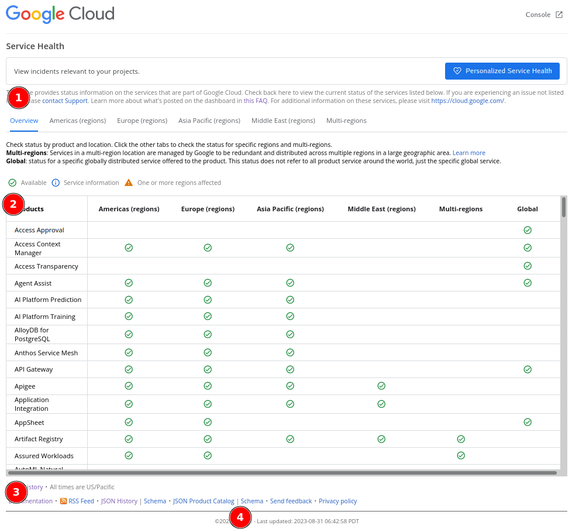
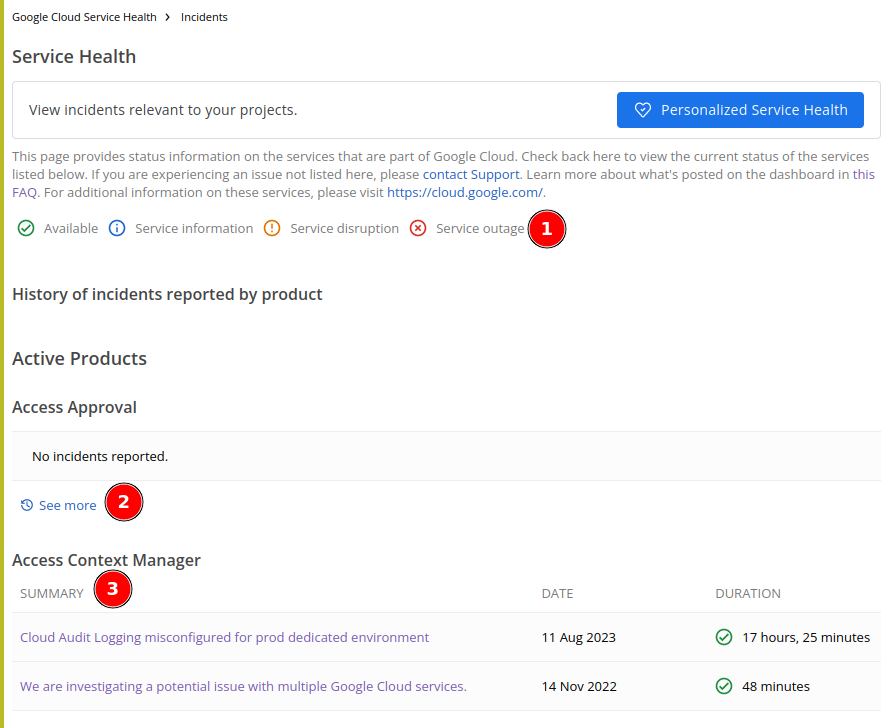
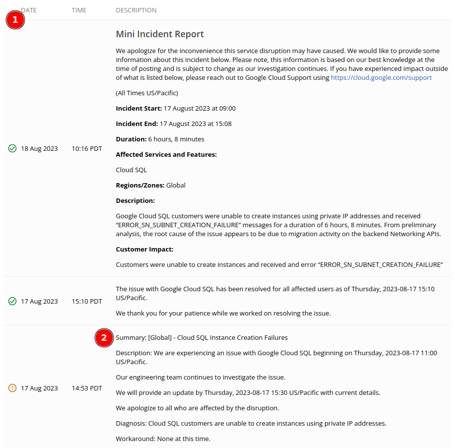
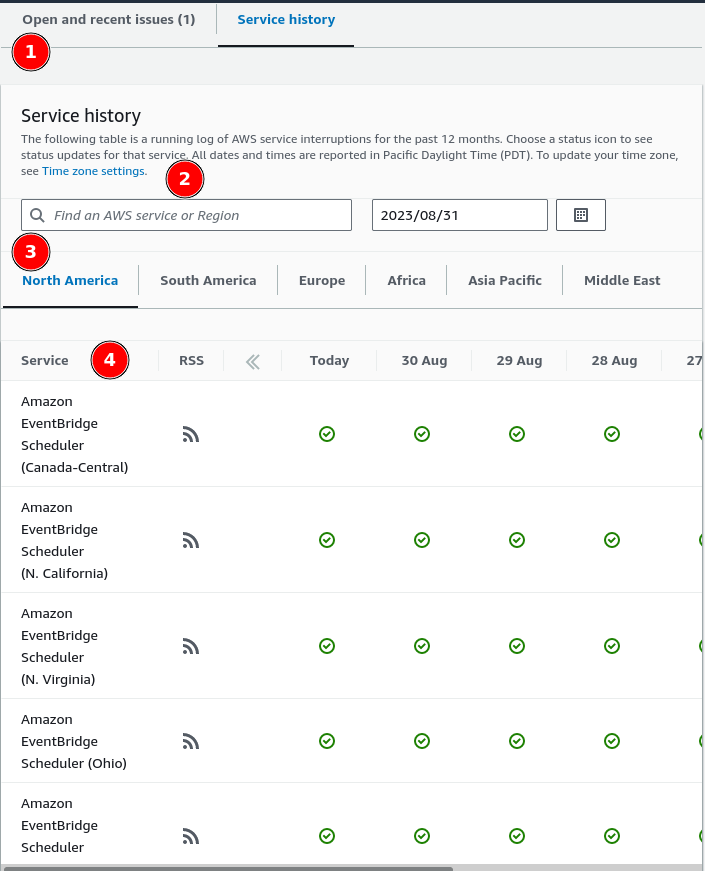
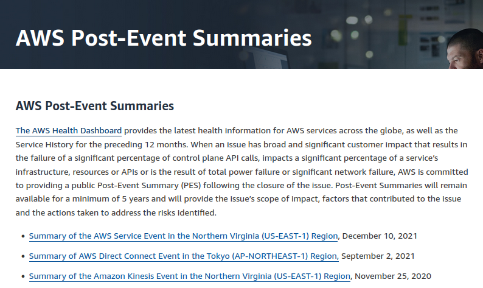
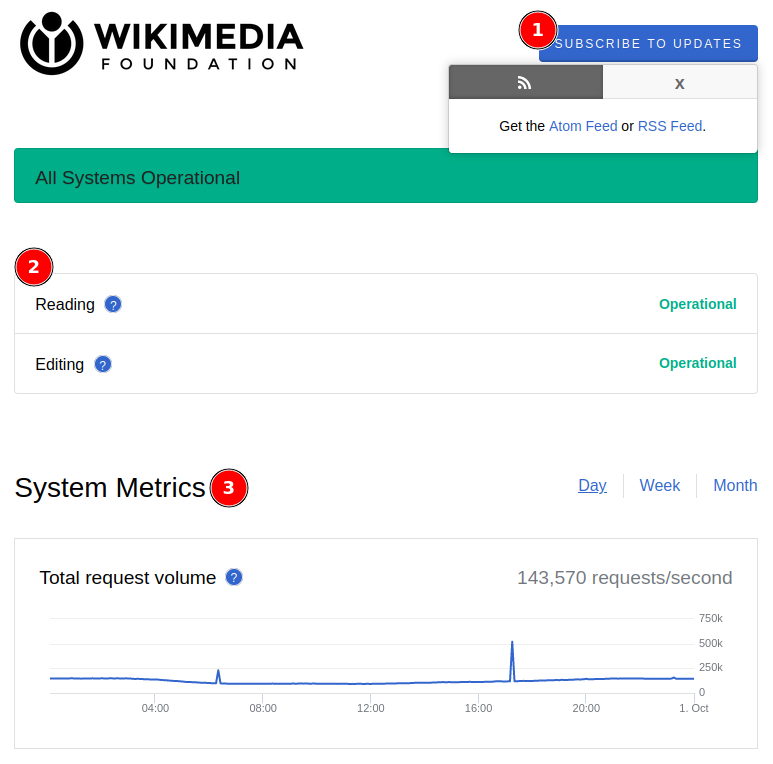
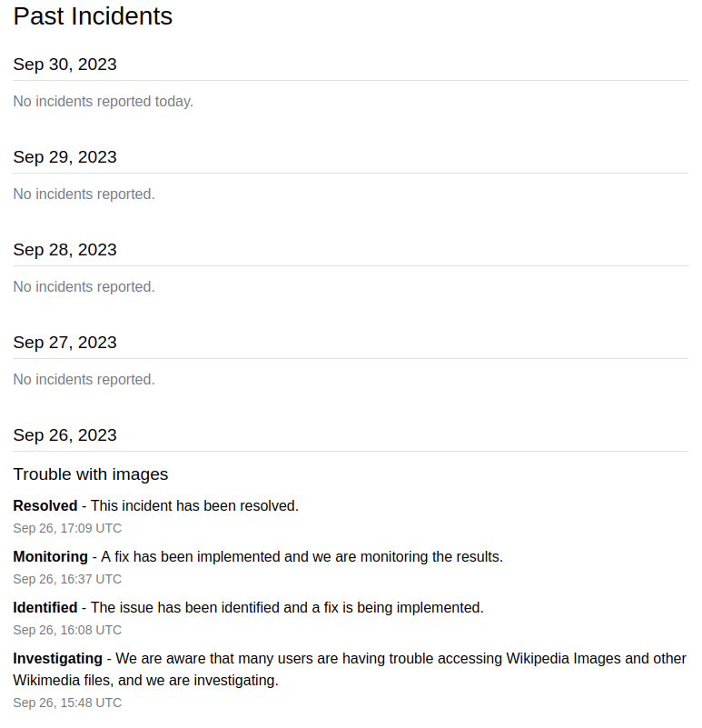
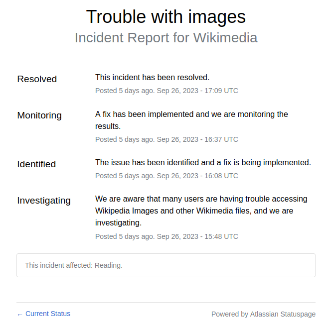

= Reviewing status page websites
August, 2023
:toc:
:sectlinks:

Status page or service health is a web site that show the status of each
service or product in the software-as-a-service (SaaS) company.
When a user found that one of the product that they use has an issue, the
status page should be the first web site that should they check.
Sometimes, status page also show the future maintenance schedules on their
services to inform the user that the issue is planned not because of
incident or external factor.

== Google Cloud Service Health

https://status.cloud.google.com/[Google Cloud Service Health].

The first status page that we will review is from Google Cloud Platform
(GCP).
The Google Cloud Service Health have several pages, and in this section we
will review only two pages, the dashboard, where we can see all services
status, and the incident history page.

(1) At the top, we can read information about the page and where to
look for more information or support.
This is good for User eXperience (UX).
If someone open this page and does not find what is about or where to look
for, they can read the information or proceed to support page.

(2) In the middle, we see all status grouped by product, regions, and the
last column as summary of all status.
Each icon that is used on each column is describe before, at the top of
table.
One thing that I did not understand in this design is why they make it have
two scrolls? (the screenshot is minimized so we can see only one scroll)
Why not just one full page, with one scroll?

(3) At the bottom, we see links to history of incident, documentation,
RSS feed, JSON history and its Schema, JSON Product Catalog and
its schema, link to Send feedback, and Privacy Policy related to the page.

One interesting note in this section is instead of providing HTTP API to
fetch the status programmatically, they provide a JSON file -- which may not
a regular file, but possibly a path that return a JSON content.

(4) Another interesting part here is the "Last updated:".
If we refresh the page, the date will print _when_ the status is last
updated.
Looking at the value, it could be mean that when each product status
checked in the back, the "last updated" will also set.

Next, we open the "View history" page.

The history page contains list of service and history of incidents ordered
in descending by date.

One bad UX that I found here is no index (or table of content) that link to
each service directly.
One need to scroll or search the service that they need to view manually.

(1) In this page we have two new icons, one for "Service disruption" and one for
"Service outage".
Service disruption icon will be used if the incident only affect certain
functions.
Service outage icon will be used if the incident is considered major, for
example affecting all users in a region or global.

(2) If there are more incidents in the past 12 months, it will print link
"See more" to view the rest of history.

(3) Each incident contains the summary, date, final status, and duration of
incident.

We will review two incident reports here,

* https://status.cloud.google.com/incidents/SJKw6R2zPUpwVzRPqahh[Global -
  Cloud SQL Instance Creation Failures^], that contains "Mini Incident
  Report" or "Service outage" that affect all users, and

* https://status.cloud.google.com/incidents/dS9ps52MUnxQfyDGPfkY[Multiple
  Google Cloud services in the europe-west9-a zone are impacted^], that
  contains "Incident Report" or "Service outage" that affect only certain
  region.

(1) On each incident report the progress are showed linear from the end (when
incident resolved) until it start (when incident begin).
On the top, we see the full report that summarize the incident,
that contains the start and end date, duration, affected services and/or
features, regions/zones, "Description" that describe the cause of
incident, and "Customer Impact".

(2) On each incident progress, it contains "Date", "Time", "Summary",
"Description", "Diagnosis", and "Workaround", for every update.

==  AWS Health Dashboard

https://health.aws.amazon.com/health/status[AWS Health Dashboard]
also split into two pages: the summary of each service status and its
history on different page.

.

(1) If you open the AWS Health Dashboard for the first time and there is no
current open issue, the page will focus on the tab "Service history"
immediately.
But, if there is an open issue, the "Open and recent issue" tab will be the
active on.

(2) One good UX in this section is by providing quick search instead of
clicking and scrolling.

(3) The health status grouped by region first and then by its service.
On each service we can view the previous status by its date.
This allow users in, for example, Asia Pacific, to click on tab "Asia
Pacific" and review the current service status on that area alone.

(4) Unlike in GCP, AWS provide RSS for each service.
So, if you are customer of AWS in Asia that use only EC2, you can subscribe
only to that status, not all of them.
It also provide a quick history of service status for the past seven days.

If you scroll to the bottom, we can see the link to
https://aws.amazon.com/id/premiumsupport/technology/pes/[post-even
summaries].

.

The post-event are aggregated by service and year.
Surprisingly, AWS have low number of incidents.

== Wikimedia status page

The third and last status page that we will review is
https://www.wikimediastatus.net/[Wikimedia status page].
Wikimedia is the organisation/foundation that run wikipedia.org.

Wikimedia status page use the famous
https://www.atlassian.com/software/statuspage?utm_campaign=kilabit.info[Statuspage^]
from Atlassian, that also used by Digital Ocean, DropBox, and many else.

The status page of Wikimedia is quite simple.

(1) In the top, user can subscribe to get the latest status page using Atom
or RSS feed.

(2) In the middle, we see list of services.
I am quite surprised that they group it by functionality (Reading and
Editing) instead of per project since they have many sister projects like
wikibooks.org, wikiquote.org, wikidata.org, and others; not only
wikipedia.org.

(3) In the bottom-middle we see metrics of their infrastructure, for
example "Total request volume", "User-reported connectivity errors", "Wiki
error responses", and so on.
Even thought this is meaningful for technical standpoint, but for layman I
think this information is quite useless.
If the service is down, total requests probably 0, both information already
covered either by "Reading" or "Editing" status.
Also, there is no clear information whether the metrics is for all projects
under Wikimedia or only wikipedia.org alone.

Next, if we scroll to bottom, we can see list of history for past incidents.

The past incidents is grouped by day.
You can click on incident summary item, it will redirect you to new page but
the information is almost the same with the previous one, seems like
redundant.

== Summary

After reviewing three status pages, there are several points that we can
takes.

First, the domain or website that host status page should not on the same
server that host the application.
In case the main host is disrupted, it would not affect the status page
website itself.
As we see in above, the main website for GCP is cloud.google.com and their
status page is located under status.cloud.google.com.
The Wikimedia main websites is located at wikimedia.org, wikipedia.org, and
so on; but their status page is located at www.wikimediastatus.net.

Second, the first page should display list of all services with their latest
status.
If there is an incident or maintenance it should be at the top or inline
with the service status, indicated by an icon or other simple indicator that
easy to distinguished with healthy status.

Third, user should have option to subscribe to services status without
opening the status page website.
The most common option is by using Atom or RSS feed.
The other option including HTTP API.
There are other status page that provide subscription through email, but I
think this is not efficient.
Imagine N users subscribes to our status services, we need a
functionality to broadcast each incident to N users at the same time.
An email like subscription or notification maybe make sense for planned
maintenances.

Fourth, user should be able to view history of last incidents.
This is to provide transparent information and audit.
For example, if user depends/use one of main services, this will allow them
to cross check the previous incidents with errors on their side,
"Why we cannot access X API at <day> <time>? Oh, I see, there is an
incident/maintenance at that time".

Five, providing metrics like "Total request", does not add any value for
non-technical persons, so it should not a primary information for status
page.

Six, if possible, do not let user scroll or search by itself.
Provide a table of content or search or filter by service as minimal as
possible.

Based on above points, a status page contains at least four components,

* list of service and its current health status,
* function to subscribe to service status, either global or individual
  service;
* history of incidents per service, and
* detailed information about incident.

Each service have the following properties,

* name,
* current status,
* region (optional), where each region may have their own status

Each incident summary have the following properties,

* service name, which linked to above -- the Who
* summary, a short description that describe the incident -- the What,
* the time when incident started -- the When,
* the time when incident stopped or resolved,
* level of incident - its either minor, affect only portion of users or
  region; or major affect all users or in all regions.
* duration, which can be subtracted from time started until time stopped or
  manually filled after incident is resolved.

The incident information linked to incident summary, its contains detailed
information, as a report, from the beginning of incident until its been
solved.

Each Incident information contains the following properties,

* time,
* status -- either still on-going or has been resolved, and
* information.

There are no rules on interval when each incident information should be
reported back when its still ongoing.

// vim: expandtab:ts=4:sw=4:
