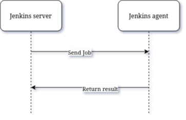
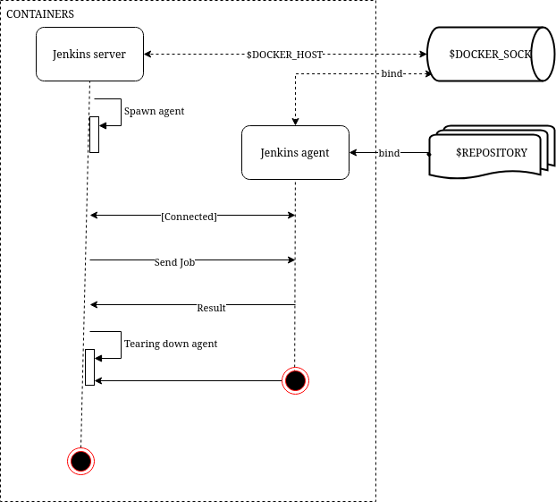
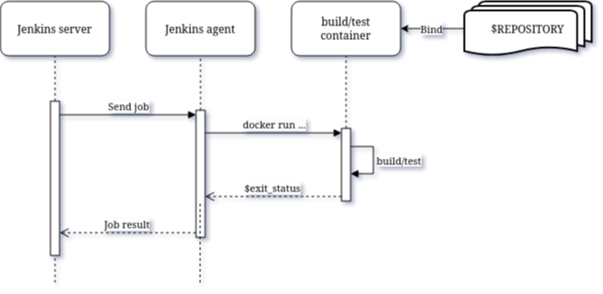

= Peculiar engineering at new company
:toc:

In April 2024, I join a large, enterprise Electronics/Information
Technology company in Indonesia with hundreds of engineers.
After eight years working in two small startups, I found that working at
large company is something new, a refreshing environment.

In this journal, I want to collect some of the weird and amusing cases of
software engineering and IT in general.
Please takes this notes as your future reflection, not as critics, so we can
learn together.

== Weird IP address

When I got my laptop, I get assigned with 107.xxx.xxx.xxx IP address.
My forehead immediately wrinkled.
If not mistaken this IP address is not in private network.
After checking with WHOIS database, it is a public IP address belong to
ATT-MOBILITY-LLC.

Also, there is some websites that we cannot be opened and some are broken.
Some are actually blocked, and some websites maybe broken due to IP address
conflict with our "internal" networks.

== Dockerism

=== Case 1: Over dockerism

Over dockerism is when you try to dockerize everything which makes things
that should be simple become complicated without any additional advantages.

In my case, we try to run Jenkins using docker.
Not only that, the agent (the one that responsible to run the Jenkins' jobs)
also run inside the docker.

Notes that, we are a small team, a three person with only three-to-five
active repository.

Things that should be simple like these,

.

Become complex like these,

.

Running Jenkins server in container will be make sense if your distro cannot
provides Java version that is supported by Jenkins.
Jenkins application is distributed in war file that can be run in single
command.
It only needs a dedicated user (to isolate with the rest of system) and a
directory, as a workspace.

Running Jenkins agent that triggered by Jenkins server does not make sense
on small team.
It make senses if you are creating an application like GitHub Actions or
Circle-CI where a resource needs to be limited (but in my theory, the agent
should be running 24/7, not start-and-stopped frequently).

There is another problem that I found when we run a Jenkins agent as
container.
Assume that your project require three tools to build, lint, and test.
The frontend require nodejs and npm, and the backend require python with
pyenv.

If we trigger the job inside the Jenkins agent, we need to either,
(1) install all of those tools inside the same image as Jenkins agent, or
(2) install it as separate images, like agent-with-nodejs and
    agent-with-pyenv.

The list of things that you need to do (building image, testing image,
deploying images) become cumbersome.

The simplest solution is by installing and managing the nodejs using nvm and
python version using pyenv, inside the host OS and run the agent directly
from the host too.

Using container is make sense if your projects depends on archaic or
specific version of glibc or third party libraries that are NOT supported on
the host operating system (which you should upgrade).

.

The containers contains the tools and what the agent do is to mount the
repository into the container and run build, lint, test inside the
container.

When you want to upgrade the tools to new version, you create new image and
publish it and update the Jenkins job to use new image.

=== Case 2: Multiple services on one container

Even thought it is possible to run multiple services inside one container,
it is
https://docs.docker.com/config/containers/multi-service_container/[advisable to separate it^].

In our case, we have one containers that run five services in the
background, three backends, one HTTP server, and one message broker.

We use s6 to do that.
