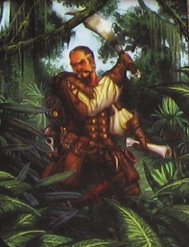

= Two types of leader
:description: Two types of leader
:sectanchor:
:toc:

In the work environment, you may heard that to become a leader some of
the requirements that they asked is experiences in leading several
peoples, good communications, and know how to take risk or making
decisions.

When people imagine this kind of leader, they imagine a war hero like
Genghis Khan, a successful CEO like Steve Jobs, award winning
football captain.

This is type 1 leader, an alpha leader, an old concept of leader.

This kind of leader is the one that walk in the front, a trailblazer,
when confronted with other tribes, they are the one that do the
negotiation, fight or flight.
Type 1 leader assign or delegate the tasks to other to reach the goal.
This type of leader is common, we see it everywhere.

* * *

In school, asian school, from elementary to university, each student
is assigned into one classroom until they move to the next grade.
In each classroom they elect collectively one of class leader, and one
of treasurer if needed.
Some of the class leader responsibilities includes bridging
communication between teachers and the students, collect assignments,
cleaning up board, calling the teacher when they arrive late; and all
other chores that help students and teachers study and teach in peace
and order.
In other words, we some times jokes, with respect, that call them as
class "maid".

This is type 2 leader.

Type 2 leader is not walking in the front, they walk in the back,
behind everyone to make sure that no one left behind.
It's the members of the team that open the path, do what they can and
must do.
When confronted with other tribes, type 2 leader find a way to make
them co-operate with their tribes, fight is not an option, flight is
better if its can save everyone.
Type 2 leader help others to reach the common goal.

* * *

Of course, in the real world it is not black and white.
In the harsh condition you will need type 1 leader to bring order,
otherwise there will be chaos.
In the advanced condition, you may need type 1 and 2 leaders at the
same times.
The good leaders is the one that can adapt to the conditions and its
members.
